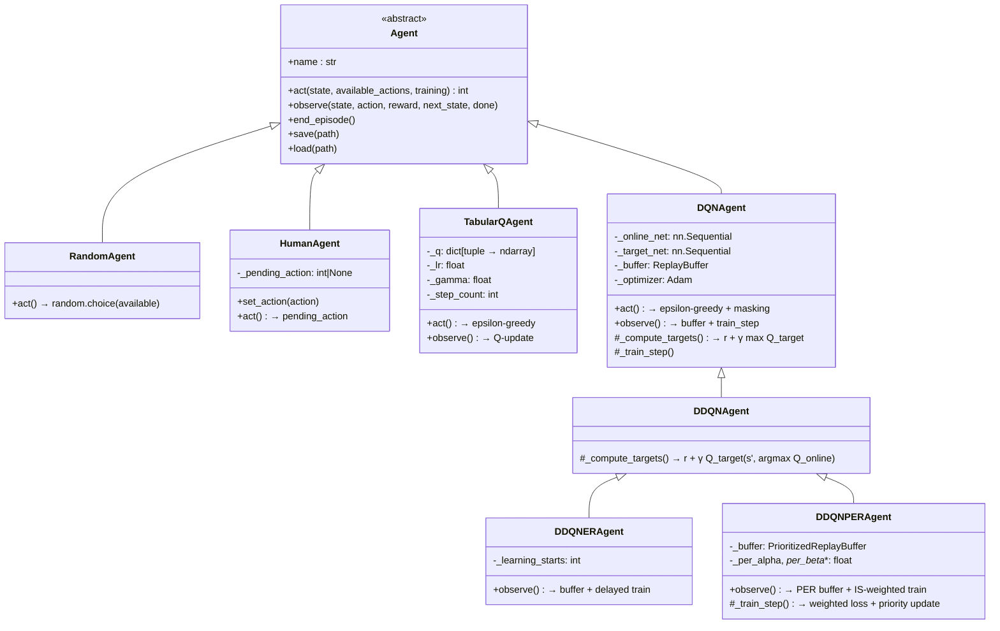
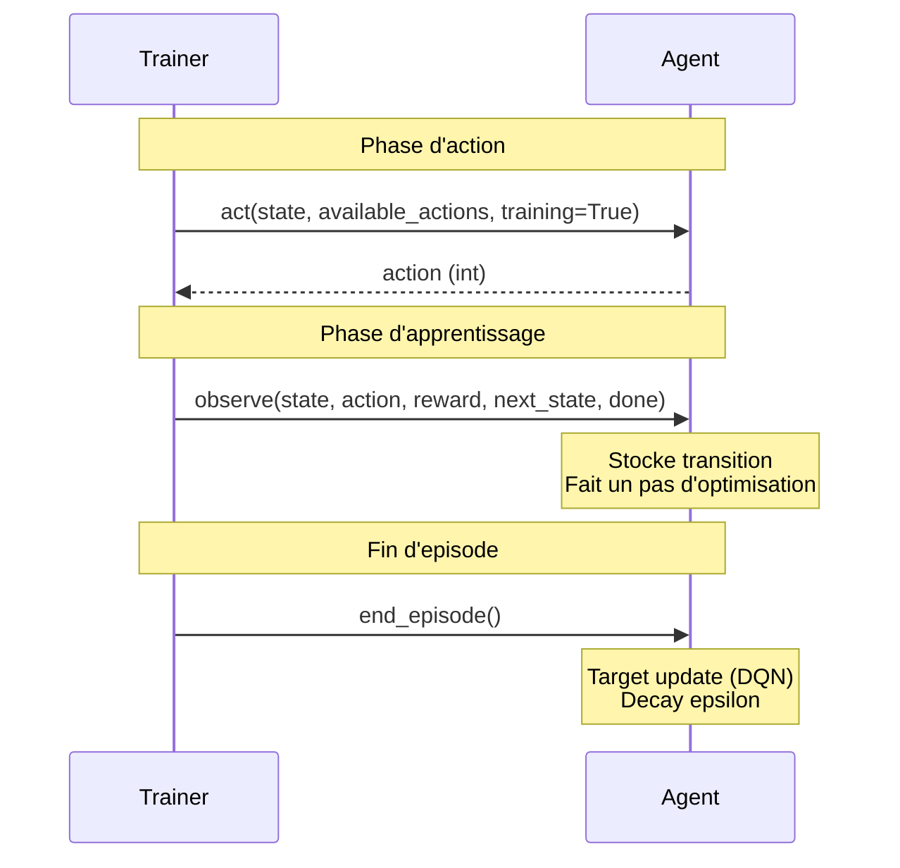
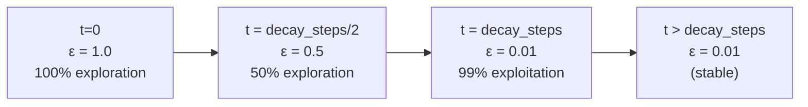
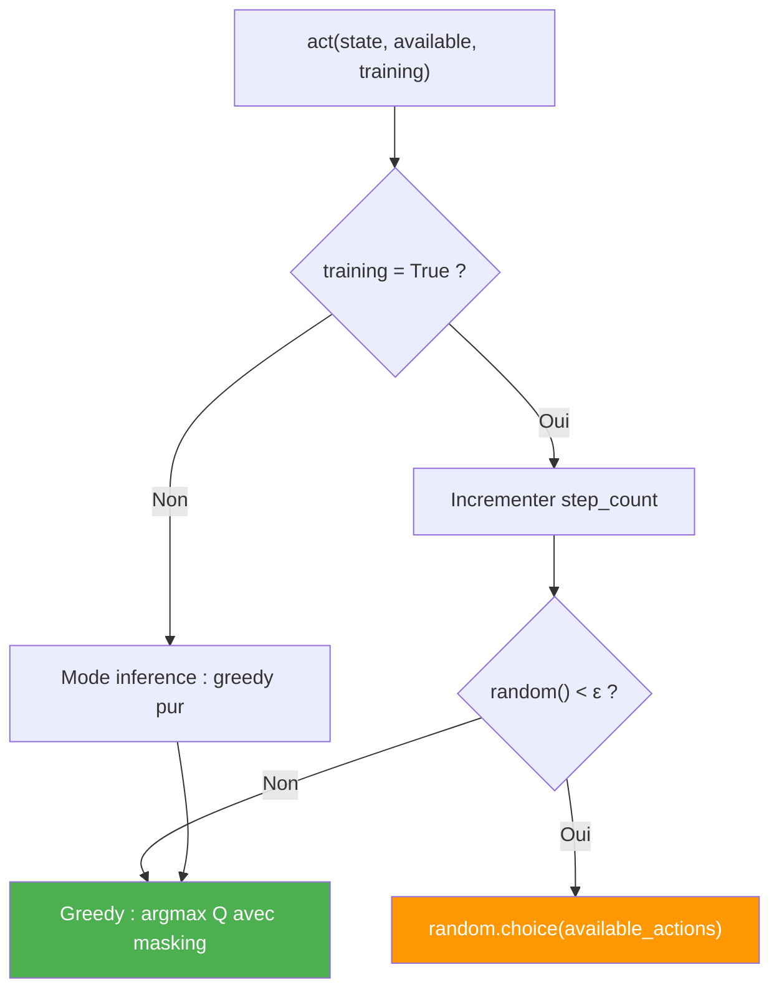

# Vue d'ensemble des Agents

## Hierarchie des classes



---

## Tableau comparatif des agents

| Agent | Methode | Representation Q | Exploration | Replay | Complexite |
|-------|---------|-----------------|-------------|--------|------------|
| **Random** | Aucune | Aucune | 100% random | Non | O(1) |
| **TabularQ** | Q-Learning | Dict de Q-values | ε-greedy decay | Non | O(1) lookup |
| **DQN** | Deep Q-Network | MLP online + target | ε-greedy decay | Uniform | O(forward pass) |
| **DDQN** | Double DQN | Idem DQN | Idem DQN | Uniform | O(2 forward pass) |
| **DDQN+ER** | DDQN + warm-up | Idem | Idem | Uniform + warm-up | Idem |
| **DDQN+PER** | DDQN + priorite | Idem | Idem | Prioritized (sum-tree) | O(log N) sample |

---

## Interface Agent : le contrat

Chaque agent doit implementer `act()`. Les autres methodes sont optionnelles (no-op par defaut).



---

## Exploration : Epsilon-Greedy avec decay lineaire

Utilise par TabularQ, DQN, DDQN et variantes.

```
ε(t) = ε_start + (ε_end - ε_start) × min(t / decay_steps, 1.0)
```



### Logique de decision



---

## Sauvegarde et chargement

| Agent | Format | Contenu |
|-------|--------|---------|
| **Random** | Rien | Pas de parametres |
| **Human** | Rien | Pas de parametres |
| **TabularQ** | `.pt` (pickle) | Q-table (dict) + step_count |
| **DQN/DDQN/...** | `.pt` (torch) | online_net, target_net, optimizer, step_count, update_count |

---

## Compatibilite Agent × Environnement

| | LineWorld | GridWorld | TicTacToe | Bobail |
|---|---|---|---|---|
| **Random** | Oui | Oui | Oui (vs opponent) | Oui (vs opponent) |
| **Human** | Oui (clavier) | Oui (clavier) | Oui (clic) | Oui (clic 2 etapes) |
| **TabularQ** | Oui | Oui | Theorique (trop d'etats) | Non (espace trop grand) |
| **DQN** | Oui | Oui | Oui | Oui |
| **DDQN** | Oui | Oui | Oui | Oui |
| **DDQN+ER** | Oui | Oui | Oui | Oui |
| **DDQN+PER** | Oui | Oui | Oui | Oui |
