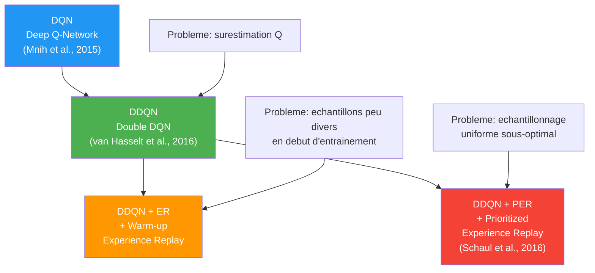
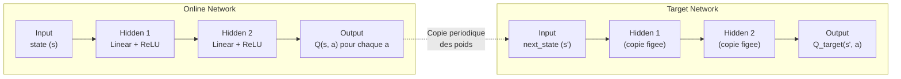
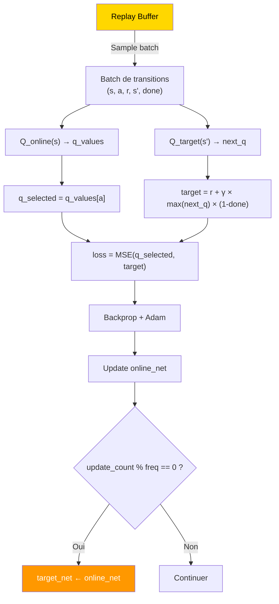
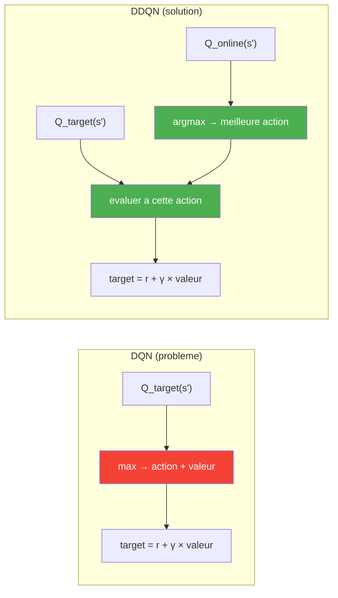
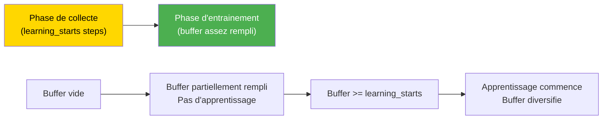
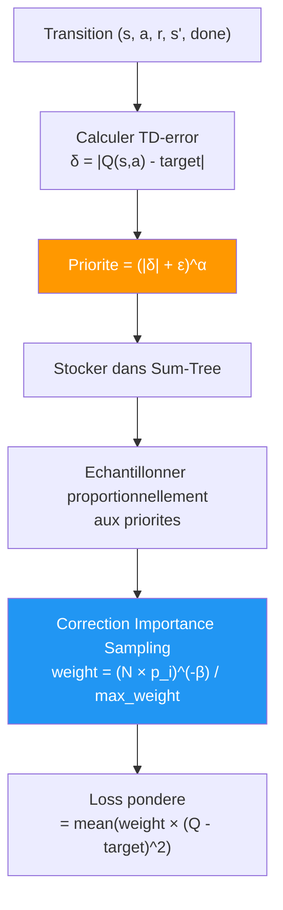

# Famille DQN : Deep Q-Networks

## Evolution des algorithmes



---

## 1. DQN — Deep Q-Network

### Architecture



### Formule de la target DQN

```
target = r + γ × max_a' Q_target(s', a') × (1 - done)
```

### Pas d'optimisation



### Hyperparametres DQN

| Param | Description | Typique |
|-------|-------------|---------|
| `lr` | Learning rate Adam | 0.0001 - 0.001 |
| `gamma` | Facteur de discount | 0.99 |
| `epsilon_start` | ε initial | 1.0 |
| `epsilon_end` | ε final | 0.01 |
| `epsilon_decay_steps` | Steps pour le decay | 10000 - 50000 |
| `hidden_layers` | Architecture MLP | [64, 64] ou [128, 128] |
| `batch_size` | Taille du mini-batch | 32 ou 64 |
| `buffer_capacity` | Taille max du replay buffer | 10000 - 50000 |
| `target_update_freq` | Frequence de copie target | 100 - 500 |

---

## 2. DDQN — Double Deep Q-Network

### Probleme resolu : surestimation des Q-values

DQN utilise le **meme reseau** pour selectionner ET evaluer la meilleure action :
```
target_DQN = r + γ × max_a' Q_target(s', a')
                      ↑ sélection ET évaluation par target_net
```

Cela cause une **surestimation systematique** car les erreurs d'estimation sont toujours dans la direction positive (max d'estimations bruitees > vraie valeur).

### Solution DDQN

**Decoupler** la selection et l'evaluation :

```
best_a = argmax_a' Q_online(s', a')       ← online choisit la meilleure action
target_DDQN = r + γ × Q_target(s', best_a)  ← target evalue cette action
```



### Code (la seule methode qui change)

```python
class DDQNAgent(DQNAgent):
    def _compute_targets(self, rewards_t, next_states_t, dones_t):
        with torch.no_grad():
            best_actions = self._online_net(next_states_t).argmax(dim=1)  # online choisit
            next_q = self._target_net(next_states_t)
            next_q_max = next_q.gather(1, best_actions.unsqueeze(1)).squeeze(1)  # target evalue
        return rewards_t + self._gamma * next_q_max * (~dones_t).float()
```

---

## 3. DDQN+ER — Warm-up Experience Replay

### Probleme resolu : echantillons peu divers en debut d'entrainement

Au debut de l'entrainement, le replay buffer ne contient que quelques transitions. L'agent apprend sur des donnees tres correlees et peu representatives.

### Solution : delai avant apprentissage



### Condition d'entrainement

```python
def observe(self, state, action, reward, next_state, done):
    self._buffer.push(state, action, reward, next_state, done)
    # Ne pas entrainer tant que :
    # 1. Le buffer n'a pas assez de samples pour un batch
    # 2. On n'a pas atteint learning_starts steps
    if len(self._buffer) >= self._batch_size and self._step_count >= self._learning_starts:
        self._train_step()
```

---

## 4. DDQN+PER — Prioritized Experience Replay

### Probleme resolu : echantillonnage uniforme

L'echantillonnage uniforme du replay buffer traite toutes les transitions de maniere egale. Or, certaines transitions sont plus **informatives** (TD-error eleve) et devraient etre rejoues plus souvent.

### Solution : priorite proportionnelle au TD-error



### Structure Sum-Tree

```
                    [Total: 15.0]           ← Racine (somme totale)
                   /              \
          [8.0]                    [7.0]    ← Noeuds internes (sommes partielles)
         /     \                  /     \
      [3.0] [5.0]            [4.0] [3.0]   ← Feuilles (priorites)
        ↓      ↓                ↓      ↓
      trans_0 trans_1        trans_2 trans_3  ← Transitions stockees
```

**Echantillonnage O(log N)** : descendre l'arbre avec une valeur aleatoire uniforme dans [0, Total].

### Annealing de Beta (Importance Sampling)

```
β(t) = β_start + (β_end - β_start) × min(t / beta_steps, 1.0)
```

| Phase | β | Effet |
|-------|---|-------|
| **Debut** | β_start ≈ 0.4 | Correction partielle (plus de biais, mais plus stable) |
| **Milieu** | ~0.7 | Correction croissante |
| **Fin** | β_end = 1.0 | Correction complete (pas de biais) |

### Hyperparametres supplementaires PER

| Param | Description | Typique |
|-------|-------------|---------|
| `per_alpha` | Exposant de priorite (0=uniforme, 1=full) | 0.6 |
| `per_beta_start` | β initial (IS correction) | 0.4 |
| `per_beta_end` | β final | 1.0 |
| `per_beta_steps` | Steps pour anneal β | = num_episodes |
| `learning_starts` | Warm-up (comme DDQN+ER) | 5000 |

---

## Comparaison des formules de target

| Agent | Formule de target |
|-------|-------------------|
| **DQN** | `r + γ × max_a' Q_target(s', a')` |
| **DDQN** | `r + γ × Q_target(s', argmax_a' Q_online(s', a'))` |
| **DDQN+ER** | Identique a DDQN (seul le timing d'entrainement change) |
| **DDQN+PER** | Identique a DDQN (seul l'echantillonnage et la loss changent) |

---

## Composants partages

### MLP Builder (`training/networks.py`)

```python
build_mlp(input_dim, output_dim, hidden_layers, activation="relu")
```

Exemple : `build_mlp(80, 625, [128, 128])` pour Bobail :

```
Input(80) → Linear(80→128) → ReLU → Linear(128→128) → ReLU → Linear(128→625)
```

> Bobail a un etat de 80 dims : 75 canaux spatiaux binaires + 5 features strategiques (`phase`, `dist_my`, `dist_opp`, `mobilite`, `first_turn`). Voir `docs/encoding.md` pour le detail.

### Replay Buffer (`training/replay_buffer.py`)

| Type | Echantillonnage | Complexite | Utilise par |
|------|----------------|------------|-------------|
| `ReplayBuffer` | Uniforme | O(1) push, O(k) sample | DQN, DDQN, DDQN+ER |
| `PrioritizedReplayBuffer` | Proportionnel aux priorites | O(log N) push/sample | DDQN+PER |
