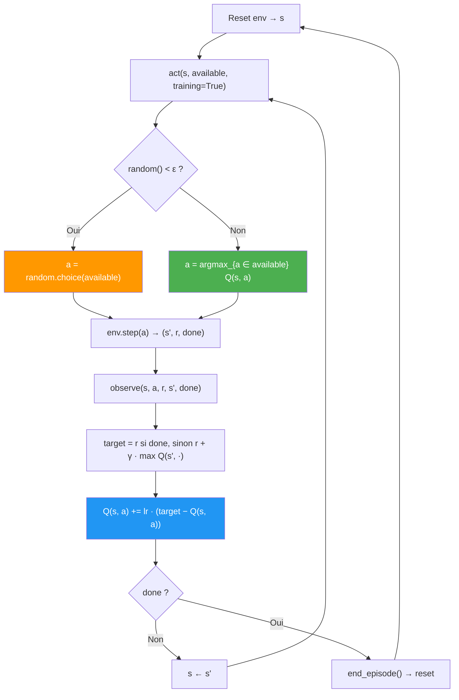

# docs/algorithms.md
# Explications des Algorithmes

> Ce document est rempli progressivement pendant l'implémentation. Pour chaque algorithme, écrire une explication **avec vos propres mots** à un niveau que vous pouvez défendre oralement. Ce document sert à la fois de préparation à la soutenance et de ressource pour les membres de l'équipe.

> **Langue :** Français. Les termes techniques anglais (Q-value, policy, reward, etc.) peuvent être conservés tels quels quand ils sont standards dans le domaine.

---

## Random Agent

*À compléter.*

---

## Tabular Q-Learning

### 1. Idée centrale

Pour chaque couple (état, action) rencontré, on maintient une estimation `Q(s, a)` de la somme des récompenses futures escomptées si on joue `a` en `s` puis qu'on suit la politique glouton par la suite. La politique est dérivée directement de la table : `π(s) = argmax_a Q(s, a)`. Aucun réseau, aucune approximation — juste un `dict` indexé par l'état.

### 2. Comment il s'entraîne

À chaque transition `(s, a, r, s', done)`, on applique la règle de Bellman en version « samples » :

```
target = r                        si done
target = r + γ · max_a Q(s', a)   sinon
Q(s, a) ← Q(s, a) + lr · (target - Q(s, a))
```

L'exploration est **ε-greedy à décroissance linéaire par step** (D-011) : au début ε=1.0 (exploration pure), à la fin ε=ε_end (≈ 0.01). Seules les actions légales sont candidates dans `act()` (D-012).

**Clé d'indexation de la Q-table :** `tuple(state.tolist())`. Fonctionne proprement sur LineWorld, GridWorld et TicTacToe, dont les encodages produisent des vecteurs float32 à valeurs discrètes {0.0, 1.0} — hashables, comparables sans erreur flottante. Sur **Bobail**, le vecteur d'état fait 80 dimensions (75 binaires + 5 features stratégiques, dont `mobilite = nb_legal / 40.0` qui est **continue**) : l'indexation par tuple reste déterministe mais perd son côté "naturellement discret", ce qui aggrave encore l'inadéquation de TabularQ pour cet environnement.

### 3. Apport vs la version précédente (Random)

- Premier agent qui **apprend** : le Random joue 100% aléatoirement sans retour d'expérience.
- Convergence prouvée vers Q* sous hypothèses standards (chaque (s, a) visité infiniment souvent, lr → 0).
- Sert de **borne haute** sur les environnements tabulaires petits (LineWorld, GridWorld) : si DQN ne l'égale pas, il y a un problème côté deep.

### 4. Limites et points de vigilance

- **Explosion combinatoire de la Q-table** : dès que l'espace d'états devient grand, le stockage et la couverture deviennent infaisables.
  - LineWorld (5 états) : trivial.
  - GridWorld (25 états) : trivial.
  - TicTacToe (~5000 états atteignables) : faisable mais lent à converger.
  - Bobail (état = 80 dims, dont une feature continue `mobilite` ; nombre de configurations ≫ 10^6) : **non utilisable en pratique**.
- **Pas de généralisation** : chaque état est indépendant. Deux états « voisins » ne partagent rien. C'est précisément ce que DQN va corriger via une fonction Q paramétrée.
- **Cible du bootstrap non masquée** : `max Q(s', ·)` inclut les actions illégales en `s'`. Leur Q-value reste à 0 (jamais mise à jour). Sur nos environnements à récompenses dans `[-1, 1]`, ça introduit un léger biais positif mais ne casse pas l'apprentissage (D-012).
- **Perspective joueur courant** : sur TicTacToe/Bobail, l'état observé est celui vu par le joueur actif (D-002). Le self-play avec `observe` différé garantit que `s` et `s'` sont du même point de vue (cf. `training/self_play.py`).

### 5. Schéma du cycle d'apprentissage



### 6. Fichier et hyperparamètres

- **Code :** `agents/tabular_q.py` (≈ 80 lignes, pas de dépendance PyTorch).
- **Configs :** `configs/tabular_q/{line_world,grid_world,tictactoe,bobail}.yaml`.
- **Hyperparamètres clés :**

| Param | Rôle | Typique |
|-------|------|---------|
| `lr` | Taux d'apprentissage de la règle TD | 0.1 |
| `gamma` | Facteur de discount | 0.99 |
| `epsilon_start` | ε initial | 1.0 |
| `epsilon_end` | ε final (plateau d'exploitation résiduelle) | 0.01 – 0.05 |
| `epsilon_decay_steps` | Steps pour passer de `epsilon_start` à `epsilon_end` | ~ nb moyen de steps sur 10–50 % des épisodes |

### 7. Vérifié empiriquement

- **LineWorld** (N=5) : reward 1.000 en 2 steps (optimum) après ≈ 2000 épisodes.
- **GridWorld** (5×5) : reward 1.000 en 8 steps (plus court chemin évitant la case −1) après ≈ 5000 épisodes.

---

## DQN (Deep Q-Network)

*À compléter.*

---

## Double DQN (DDQN)

*À compléter.*

---

## DDQN avec Experience Replay

*À compléter.*

---

## DDQN avec Prioritized Experience Replay

*À compléter.*

---

## REINFORCE

*À compléter.*

---

## REINFORCE avec baseline moyenne

*À compléter.*

---

## REINFORCE avec Critique (Actor-Critic)

*À compléter.*

---

## PPO (A2C style)

*À compléter.*

---

## Random Rollout

*À compléter.*

---

## Monte Carlo Tree Search (UCT)

*À compléter.*

---

## Expert Apprentice

*À compléter.*

---

## AlphaZero

*À compléter.*

---

## MuZero

*À compléter.*

---

## MuZero Stochastique

*À compléter.*

---

*Pour chaque algorithme, inclure :*
1. *Idée centrale (2-3 phrases)*
2. *Comment il s'entraîne (mécanisme clé)*
3. *Ce qu'il apporte par rapport à la version précédente/plus simple*
4. *Limites connues ou points de vigilance*
5. *Diagramme ou schéma si utile à la compréhension*
