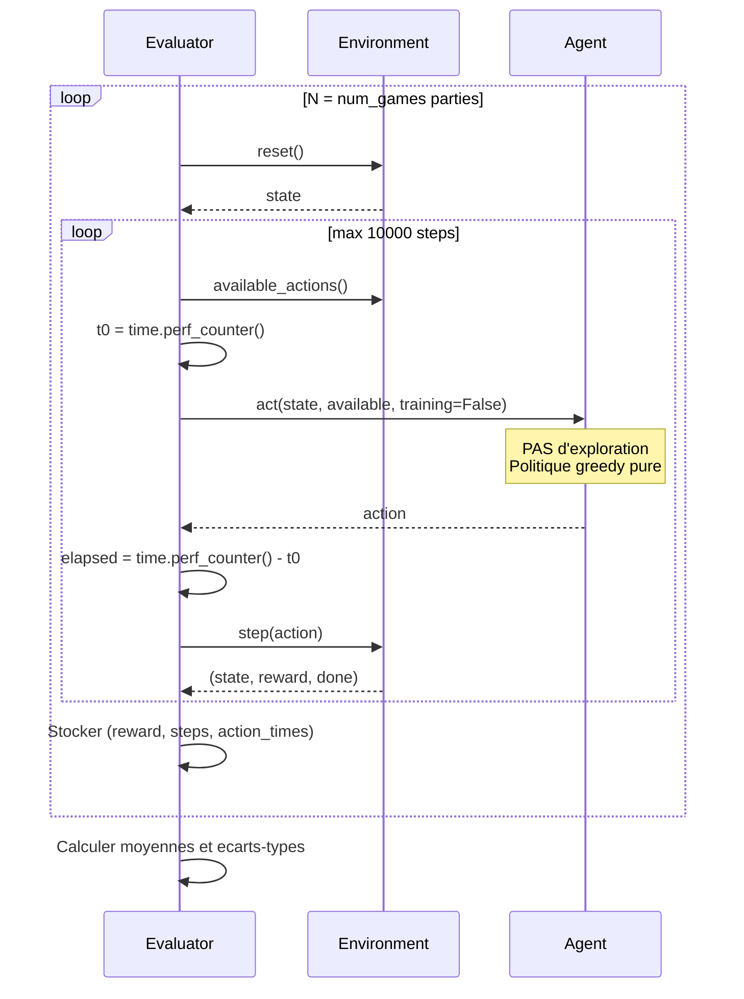
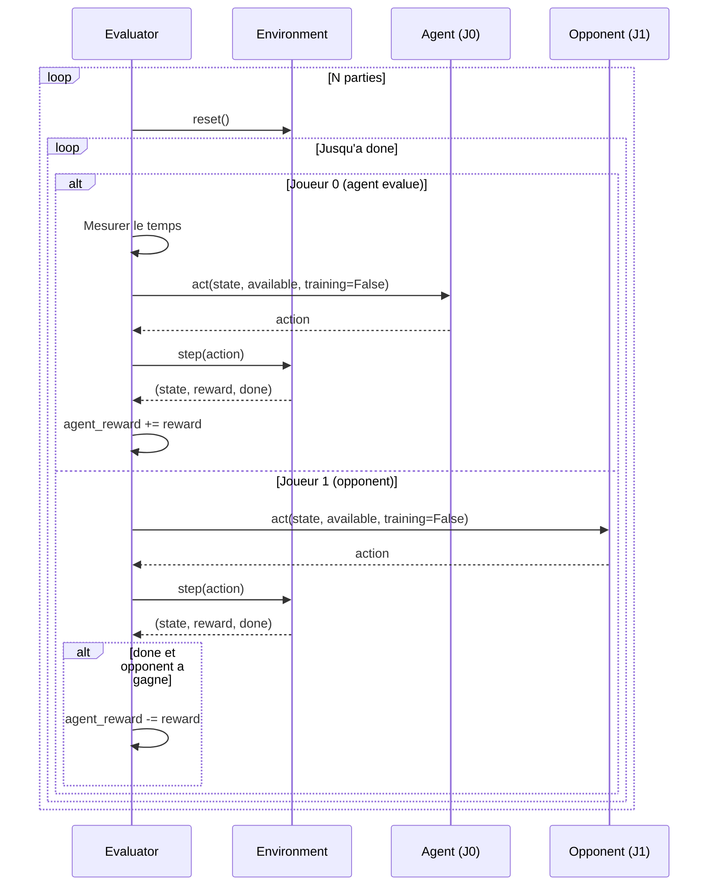
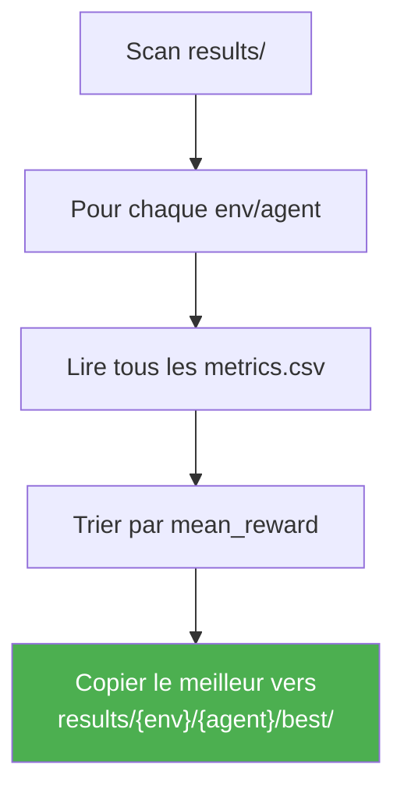

# Pipeline d'Evaluation

## Objectif

L'evaluateur mesure la performance d'un agent **en mode inference** (pas d'exploration, politique gelee) sur N parties.

Le sujet demande specifiquement :
- Score moyen a 1k, 10k, 100k episodes d'entrainement
- Temps moyen pour executer un coup
- Longueur moyenne d'une partie

---

## Metriques collectees

| Metrique | Description | Colonne CSV |
|----------|-------------|-------------|
| **Mean reward** | Recompense moyenne sur N parties | `mean_reward` |
| **Std reward** | Ecart-type de la recompense | `std_reward` |
| **Mean steps** | Longueur moyenne d'une partie | `mean_steps` |
| **Std steps** | Ecart-type de la longueur | `std_steps` |
| **Mean action time (ms)** | Temps moyen par action en millisecondes | `mean_action_time_ms` |
| **Std action time (ms)** | Ecart-type du temps par action | `std_action_time_ms` |

---

## Sequence d'evaluation : Single-Player



## Sequence d'evaluation : Adversarial



### Point important : seul le temps de l'agent evalue est mesure

Le temps de l'adversaire n'est **pas** inclus dans les metriques de performance.

---

## Quand l'evaluation est-elle executee ?


Les checkpoints sont configurables dans le YAML :
```yaml
eval:
  checkpoints: [1000, 10000, 100000]
  num_games: 100
```

---

## Promotion du meilleur modele

Le script `scripts/promote_best.py` selectionne le **meilleur checkpoint** par combinaison (env, agent) :



```bash
uv run python scripts/promote_best.py
```

Resultat :
```
results/{env}/{agent}/best/
├── model.pt       # Meilleur modele
└── config.yaml    # Configuration associee
```

La GUI charge en priorite les modeles depuis `best/`.

---

## Re-evaluation post-entrainement

```bash
uv run python scripts/evaluate_all.py
```

Ce script re-evalue tous les modeles sauvegardes et ecrit un fichier `metrics_reeval.csv` dans chaque dossier de run. Utile pour comparer les performances avec des parametres d'evaluation differents.
