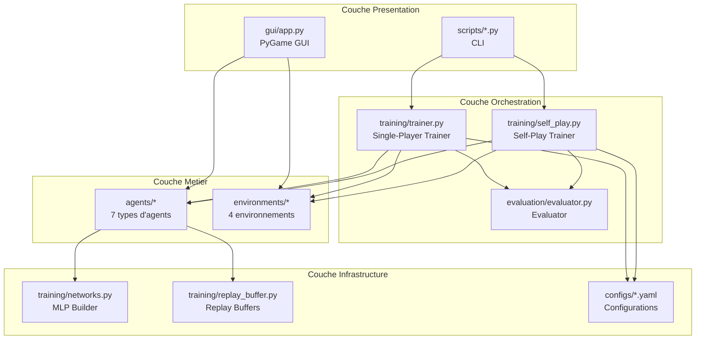
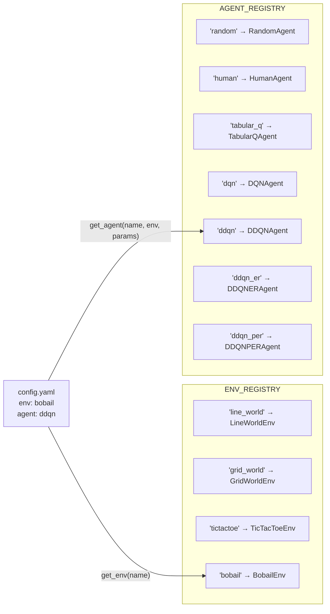
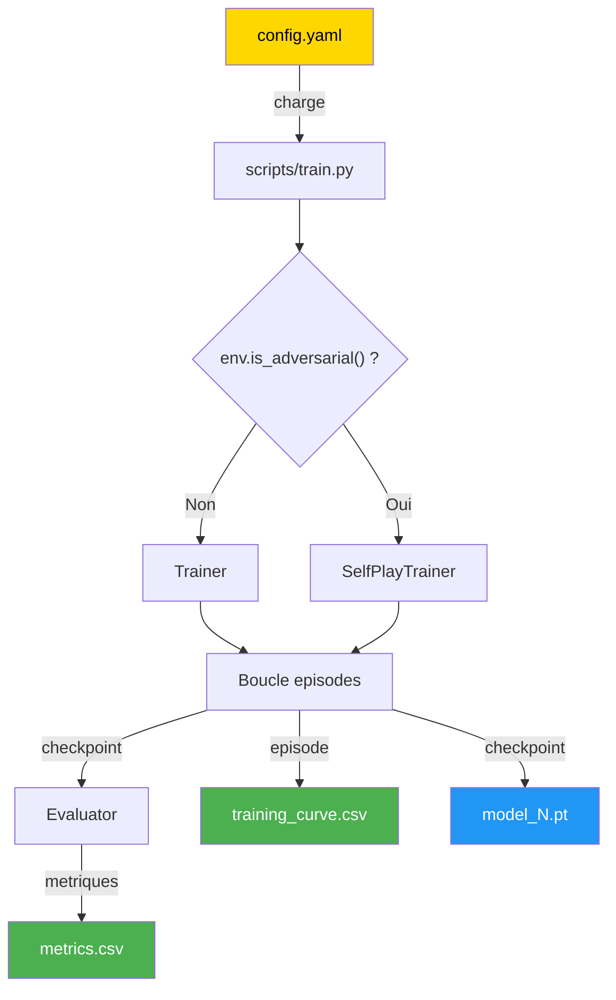
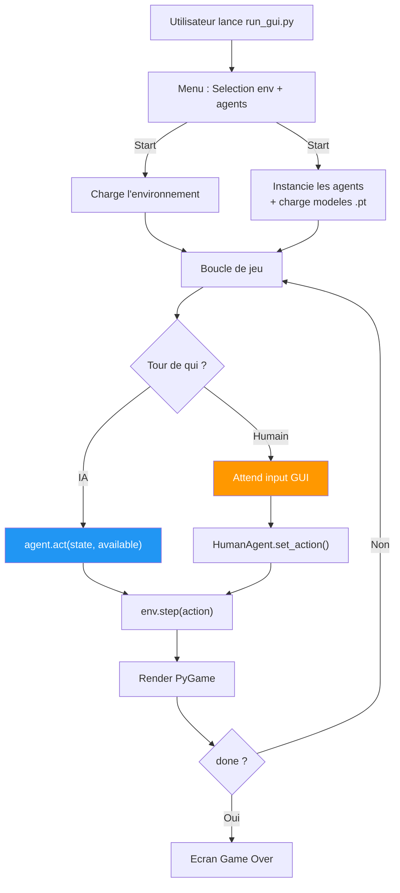

# Architecture du Projet

## Arborescence

```
projet/
├── agents/                        # Implementations des agents
│   ├── __init__.py               # AGENT_REGISTRY + get_agent()
│   ├── base.py                   # Classe abstraite Agent
│   ├── random_agent.py           # Politique aleatoire uniforme
│   ├── human_agent.py            # Pont GUI → interface Agent
│   ├── tabular_q.py              # Q-Learning tabulaire
│   └── value_based/              # Agents Deep RL
│       ├── dqn.py                # Deep Q-Network
│       ├── ddqn.py               # Double DQN
│       ├── ddqn_er.py            # DDQN + warm-up Experience Replay
│       └── ddqn_per.py           # DDQN + Prioritized Experience Replay
│
├── environments/                  # Implementations des jeux
│   ├── __init__.py               # ENV_REGISTRY + get_env()
│   ├── base.py                   # Classe abstraite Environment
│   ├── line_world.py             # Navigation 1D
│   ├── grid_world.py             # Navigation 2D
│   ├── tictactoe.py              # Morpion 3x3
│   └── bobail.py                 # Bobail 5x5
│
├── training/                      # Infrastructure d'entrainement
│   ├── trainer.py                # Boucle single-player
│   ├── self_play.py              # Boucle adversarial (self-play)
│   ├── networks.py               # Constructeur MLP (PyTorch)
│   └── replay_buffer.py          # Uniform + Prioritized replay buffers
│
├── evaluation/                    # Pipeline d'evaluation
│   └── evaluator.py              # Metriques : reward, steps, latence
│
├── gui/                           # Interface graphique
│   └── app.py                    # Application PyGame complete
│
├── scripts/                       # Points d'entree CLI
│   ├── train.py                  # Entrainer 1 configuration
│   ├── train_all.py              # Entrainer toutes les configs
│   ├── train_sweep.py            # Sweep d'hyperparametres
│   ├── evaluate_all.py           # Re-evaluer les modeles sauvegardes
│   ├── promote_best.py           # Promouvoir le meilleur modele
│   ├── run_gui.py                # Lancer la GUI
│   └── benchmark.py              # Benchmark parties/seconde
│
├── configs/                       # Configurations YAML
│   ├── random/                   # 4 configs baseline random
│   ├── tabular_q/                # 4 configs Q-learning
│   ├── dqn/                      # 5 configs + sweeps
│   ├── ddqn/                     # 4 configs
│   ├── ddqn_er/                  # 4 configs
│   └── ddqn_per/                 # 5 configs + sweeps
│
├── tests/                         # Tests unitaires & integration
│   ├── test_environments.py
│   ├── test_agents.py
│   ├── test_training.py
│   └── test_value_based.py
│
├── results/                       # Modeles entraines (production)
├── results_dev/                   # Modeles (iteration rapide)
├── docs/                          # Documentation
├── README.md
├── pyproject.toml                 # Dependances (UV)
└── uv.lock
```

---

## Couches architecturales



---

## Systeme de Registres

L'architecture utilise un pattern **Registry** pour decoupler la configuration de l'instanciation.



### Instanciation d'un agent

```python
def get_agent(name: str, env, params: dict = None):
    params = params or {}
    return AGENT_REGISTRY[name](
        state_size=env.state_space_size(),   # fourni par l'env
        action_size=env.action_space_size(),  # fourni par l'env
        **params,                             # hyperparametres du YAML
    )
```

---

## Flux de donnees : Entrainement



---

## Flux de donnees : GUI



---

## Dependances

| Package | Usage |
|---------|-------|
| `torch` | Reseaux de neurones (DQN, DDQN) |
| `numpy` | Vecteurs d'etats, calculs numeriques |
| `pygame` | Interface graphique |
| `pyyaml` | Lecture des configurations |
| `pytest` | Tests (dev) |
