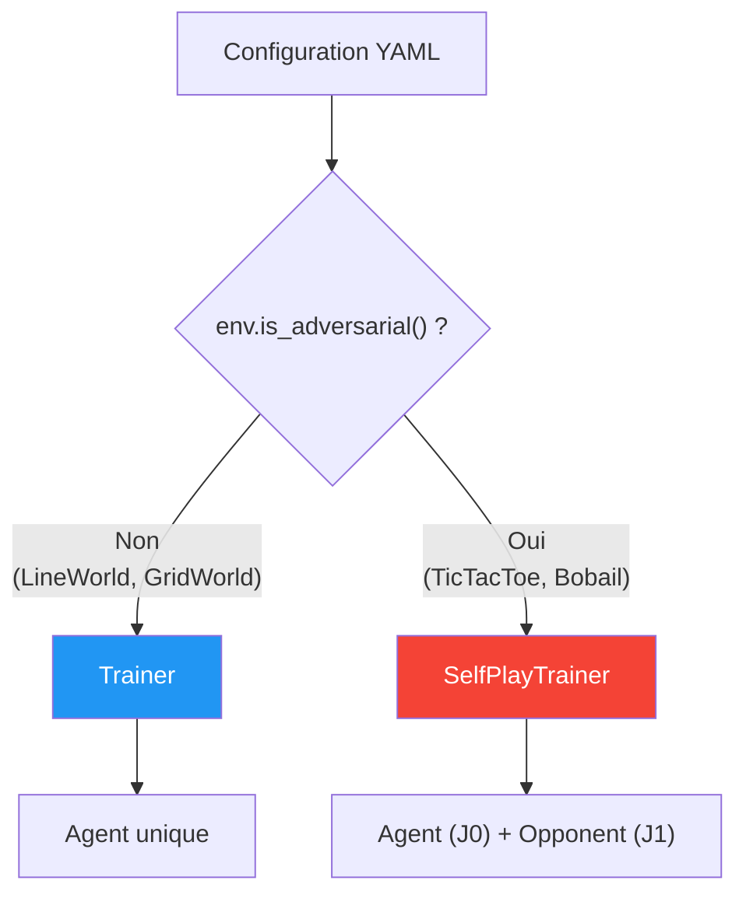
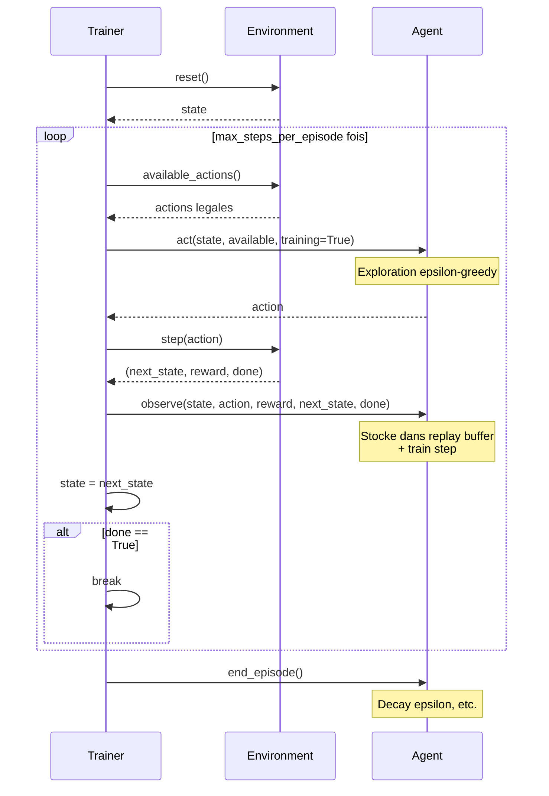
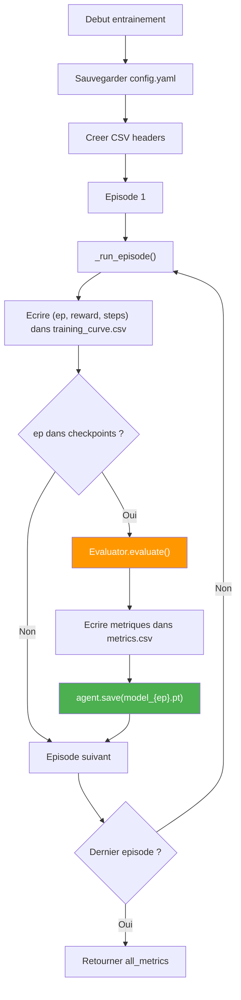
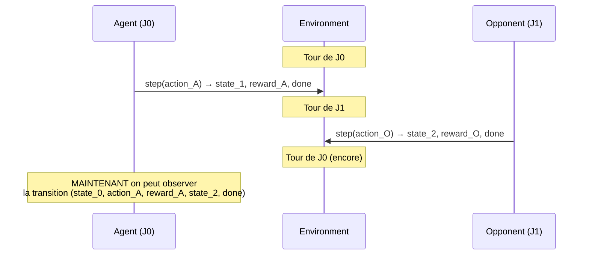
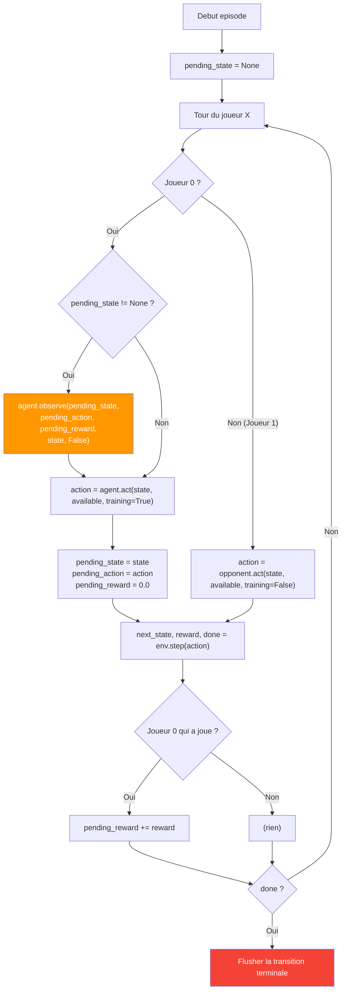
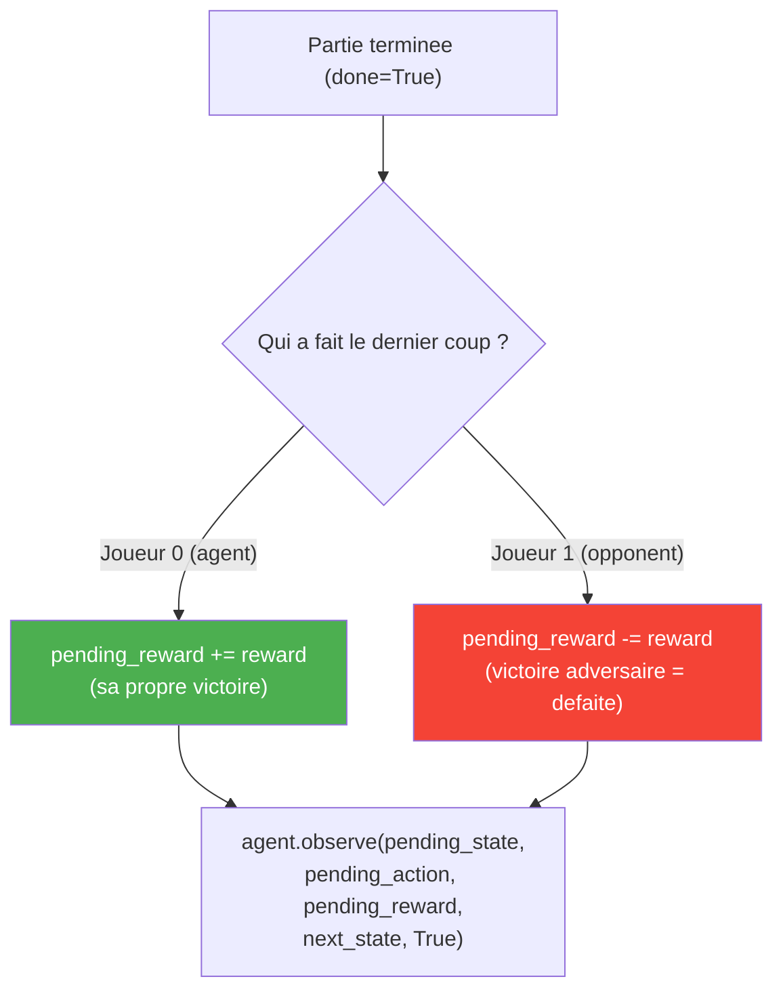

# Pipeline d'Entrainement

## Vue d'ensemble

Deux trainers sont implementes selon le type d'environnement :

| Trainer | Fichier | Utilisation |
|---------|---------|-------------|
| `Trainer` | `training/trainer.py` | Environnements single-player (LineWorld, GridWorld) |
| `SelfPlayTrainer` | `training/self_play.py` | Environnements adversariaux (TicTacToe, Bobail) |



---

## 1. Trainer (Single-Player)

### Sequence d'un episode



### Cycle complet d'entrainement



---

## 2. SelfPlayTrainer (Adversarial)

### Le probleme du "Deferred Observe"

Dans un jeu a 2 joueurs, l'agent (joueur 0) **ne joue pas a chaque step**. Le probleme : quand l'agent joue a l'instant `t`, le `next_state` qu'il verra est celui quand ce sera **a nouveau son tour**, pas le state juste apres son action.



### Mecanisme du Pending State



### Gestion des rewards a la terminaison



**Pourquoi `-= reward` quand l'adversaire gagne ?**

- Le reward de `env.step()` est du point de vue du **joueur qui vient de jouer**
- Si l'adversaire gagne, son reward = +1.0
- Du point de vue de l'agent, c'est une defaite = -1.0
- Donc : `pending_reward -= reward` (soit `0 - 1.0 = -1.0`)

---

## Configuration YAML

### Structure

```yaml
env: bobail                         # Nom dans ENV_REGISTRY
agent: ddqn                         # Nom dans AGENT_REGISTRY
opponent: random                    # (adversarial) Nom de l'opposant

agent_params:                       # Hyperparametres specifiques a l'agent
  lr: 0.001
  gamma: 0.99
  epsilon_start: 1.0
  epsilon_end: 0.01
  epsilon_decay_steps: 20000
  hidden_layers: [64, 64]
  batch_size: 64
  buffer_capacity: 10000
  target_update_freq: 200

training:
  num_episodes: 100000              # Nombre total d'episodes
  max_steps_per_episode: 200        # Limite par episode

eval:
  checkpoints: [1000, 10000, 100000]  # Episodes ou evaluer
  num_games: 100                       # Parties d'evaluation par checkpoint

seeds: [42, 123, 456]               # Seeds pour reproductibilite
```

### Scripts d'entrainement

```bash
# Entrainer une seule configuration
uv run python scripts/train.py configs/dqn/grid_world.yaml

# Mode rapide (pour iteration)
uv run python scripts/train.py configs/dqn/grid_world.yaml --quick --quick-episodes 500

# Entrainer toutes les configs d'un dossier
uv run python scripts/train_all.py configs/dqn/

# Sweep d'hyperparametres
uv run python scripts/train_sweep.py configs/dqn/grid_world_sweep.yaml
```

---

## Fichiers de sortie

```
results/{env}/{agent}/{run_name}_seed{N}/
├── config.yaml              # Snapshot de la configuration exacte
├── training_curve.csv       # episode, reward, steps
├── metrics.csv              # checkpoint, mean_reward, std_reward, ...
├── model_1000.pt            # Checkpoint a 1000 episodes
├── model_10000.pt           # Checkpoint a 10000 episodes
└── model_100000.pt          # Checkpoint a 100000 episodes
```

| Fichier | Contenu | Utilisation |
|---------|---------|-------------|
| `training_curve.csv` | `[episode, reward, steps]` par episode | Courbes d'apprentissage |
| `metrics.csv` | `[checkpoint, mean_reward, std_reward, mean_steps, std_steps, mean_action_time_ms, std_action_time_ms]` | Metriques du sujet |
| `model_N.pt` | Poids du reseau ou Q-table | Chargement dans la GUI |
| `config.yaml` | Config exacte de ce run | Reproductibilite |
