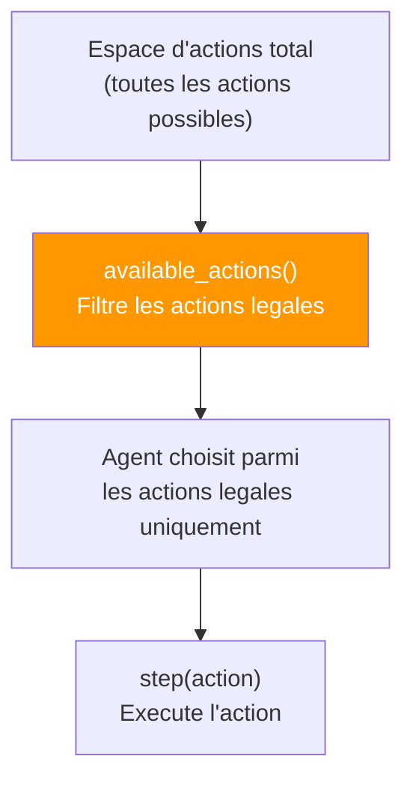
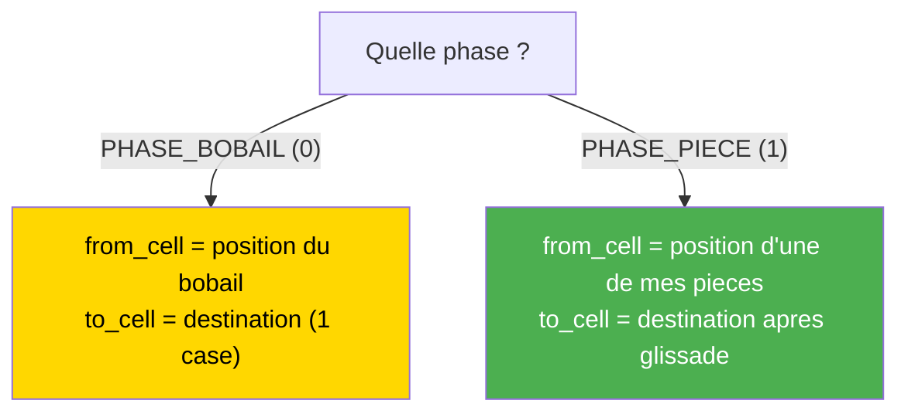
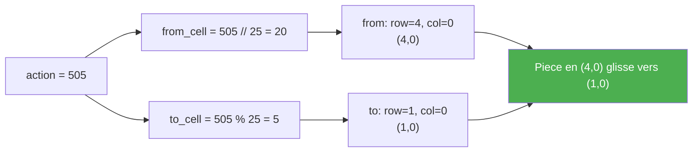
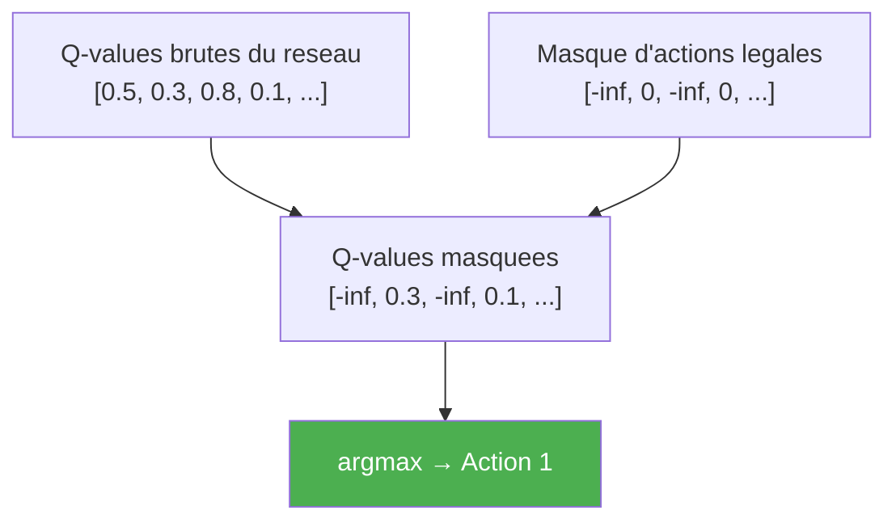

# Vecteurs d'encoding des actions

Ce document decrit comment les actions sont encodees en entiers discrets pour chaque environnement, et comment le **masquage d'actions** (action masking) garantit que seules des actions legales sont jouees.

---

## Principe general



Tous les environnements utilisent des **entiers discrets** comme actions. L'espace d'actions est fixe (`action_space_size()`), mais a chaque etape, `available_actions()` retourne uniquement les actions **legales**.

---

## 1. LineWorld : 2 actions

| Action | Signification | Condition de legalite |
|--------|---------------|----------------------|
| `0` | Aller a gauche | `pos > 0` |
| `1` | Aller a droite | `pos < size - 1` |

```
Position 0 :  available = [1]        (ne peut aller qu'a droite)
Position 2 :  available = [0, 1]     (peut aller dans les deux sens)
Position 4 :  available = []         (jeu termine, goal atteint)
```

---

## 2. GridWorld : 4 actions

| Action | Direction | Delta (row, col) | Condition de legalite |
|--------|-----------|-------------------|----------------------|
| `0` | Haut | (-1, 0) | `row > 0` |
| `1` | Bas | (+1, 0) | `row < rows - 1` |
| `2` | Gauche | (0, -1) | `col > 0` |
| `3` | Droite | (0, +1) | `col < cols - 1` |

```
Position (0,0) coin haut-gauche :     available = [1, 3]       (bas, droite)
Position (2,2) centre :               available = [0, 1, 2, 3]  (toutes)
Position (4,4) coin bas-droite :      available = []            (goal atteint)
```

### Diagramme des actions GridWorld

```
          Action 0 (↑)
              |
Action 2 (←) ─ Agent ─ Action 3 (→)
              |
          Action 1 (↓)
```

---

## 3. TicTacToe : 9 actions

Chaque action correspond a une **cellule du plateau** :

```
Action 0 | Action 1 | Action 2
─────────┼──────────┼─────────
Action 3 | Action 4 | Action 5
─────────┼──────────┼─────────
Action 6 | Action 7 | Action 8
```

| Action | Cellule (row, col) | Condition de legalite |
|--------|-------------------|----------------------|
| `0` | (0, 0) | `board[0] == 0` (vide) |
| `1` | (0, 1) | `board[1] == 0` |
| `2` | (0, 2) | `board[2] == 0` |
| `3` | (1, 0) | `board[3] == 0` |
| `4` | (1, 1) | `board[4] == 0` |
| `5` | (1, 2) | `board[5] == 0` |
| `6` | (2, 0) | `board[6] == 0` |
| `7` | (2, 1) | `board[7] == 0` |
| `8` | (2, 2) | `board[8] == 0` |

```
Debut de partie :  available = [0,1,2,3,4,5,6,7,8]  (9 actions)
Apres 4 coups :    available = [1,3,5,6,8]           (5 actions)
Fin de partie :    available = []                      (jeu termine)
```

---

## 4. Bobail : 625 actions (espace sparse)

### Formule d'encodage

```
action = from_cell * 25 + to_cell
```

| Composant | Extraction | Plage |
|-----------|-----------|-------|
| `from_cell` | `action // 25` | 0-24 (cellule source) |
| `to_cell` | `action % 25` | 0-24 (cellule destination) |

### Pourquoi 625 ?

```
25 cellules sources possibles  ×  25 cellules destinations  =  625 combinaisons
```

Mais a chaque instant, seule une **petite fraction** est legale (~20-60 actions).

### Encodage selon la phase



### Exemple Phase BOBAIL

```
Bobail en cellule 12 (position (2,2)), case (1,2) vide :

  Direction nord : to_cell = 7 (position (1,2))
  action = 12 * 25 + 7 = 307

  Direction nord-est : to_cell = 8 (position (1,3))
  action = 12 * 25 + 8 = 308
```

### Exemple Phase PIECE

```
Ma piece en cellule 20 (position (4,0)), glisse vers (1,0) = cellule 5 :

  action = 20 * 25 + 5 = 505
```

### Table de correspondance des 8 directions

```
(-1,-1) (-1, 0) (-1,+1)       Deltas (dr, dc) :
( 0,-1)    P    ( 0,+1)       Piece/Bobail au centre
(+1,-1) (+1, 0) (+1,+1)
```

| Direction | (dr, dc) | Exemple depuis cellule 12 |
|-----------|----------|---------------------------|
| Nord-Ouest | (-1, -1) | → cellule 6 |
| Nord | (-1, 0) | → cellule 7 |
| Nord-Est | (-1, +1) | → cellule 8 |
| Ouest | (0, -1) | → cellule 11 |
| Est | (0, +1) | → cellule 13 |
| Sud-Ouest | (+1, -1) | → cellule 16 |
| Sud | (+1, 0) | → cellule 17 |
| Sud-Est | (+1, +1) | → cellule 18 |

### Decodage complet d'une action Bobail



---

## Action Masking dans les agents

### Principe

Lors du choix d'action, les agents n'ont acces qu'aux actions legales :

```python
# Dans agent.act() :
# 1. Mode exploration (epsilon-greedy) : choix aleatoire parmi les legales
if random.random() < epsilon:
    return random.choice(available_actions)

# 2. Mode exploitation : masquage des Q-values illegales
q_values = network(state)
mask = np.full(action_size, -np.inf)
for a in available_actions:
    mask[a] = 0.0
return argmax(q_values + mask)  # les actions illegales → -inf
```



---

## Tableau de synthese

| Env | Taille espace | Format | Actions legales typiques | Sparse ? |
|-----|--------------|--------|--------------------------|----------|
| **LineWorld** | 2 | Entier direct (0-1) | 1-2 | Non |
| **GridWorld** | 4 | Entier direct (0-3) | 2-4 | Non |
| **TicTacToe** | 9 | Entier = cellule (0-8) | 1-9 | Faible |
| **Bobail** | 625 | `from*25 + to` | ~20-60 | **Tres sparse** |
