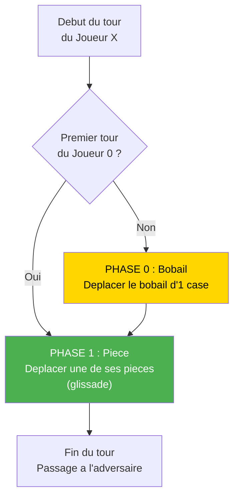
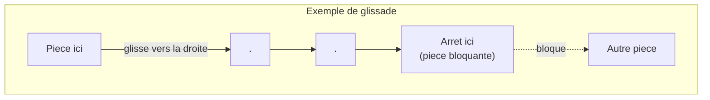
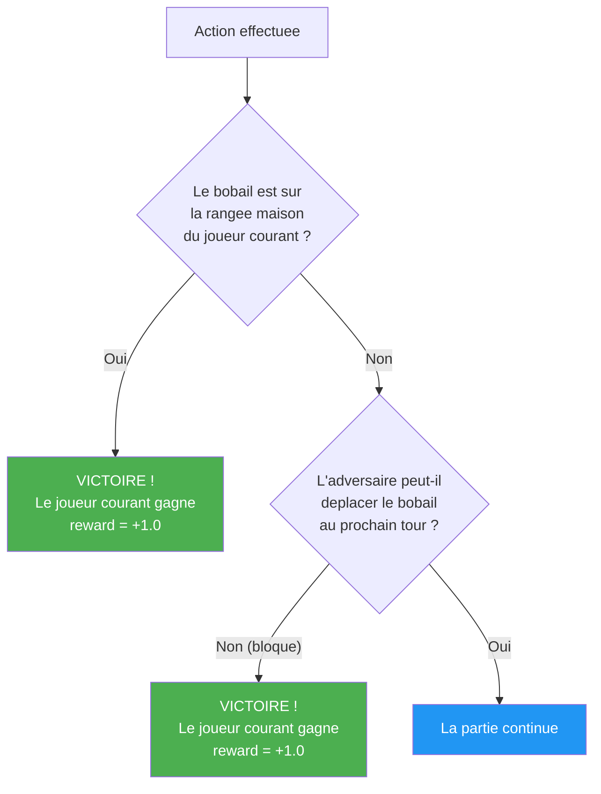
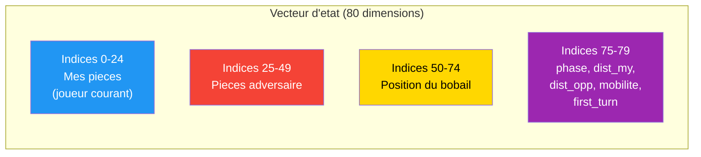
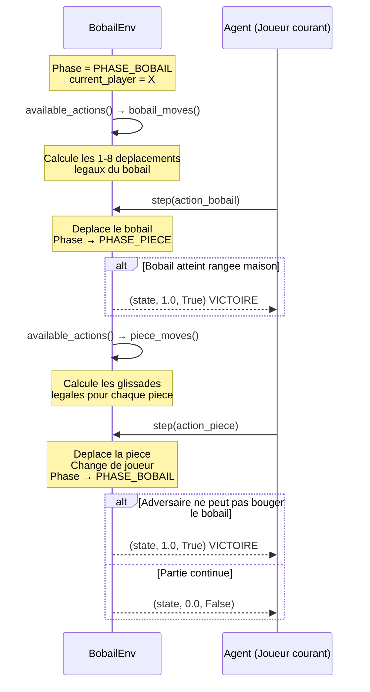

# Bobail : Le Gameplay Choisi

## Presentation du jeu

**Bobail** est un jeu de plateau strategique a 2 joueurs sur une grille 5x5. Le jeu est disponible sur [Board Game Arena](https://boardgamearena.com/gamepanel?game=bobail).

### Composants

| Element | Symbole | Quantite | Position initiale |
|---------|---------|----------|-------------------|
| Pieces Joueur 0 (bleu) | `0` | 5 | Rangee du bas (row 4) |
| Pieces Joueur 1 (rouge) | `1` | 5 | Rangee du haut (row 0) |
| Bobail (pion neutre) | `B` | 1 | Centre (2, 2) |

### Plateau initial

```
  col0  col1  col2  col3  col4
  ┌─────┬─────┬─────┬─────┬─────┐
0 │  1  │  1  │  1  │  1  │  1  │  ← Rangee maison Joueur 1
  ├─────┼─────┼─────┼─────┼─────┤
1 │  .  │  .  │  .  │  .  │  .  │
  ├─────┼─────┼─────┼─────┼─────┤
2 │  .  │  .  │  B  │  .  │  .  │  ← Bobail au centre
  ├─────┼─────┼─────┼─────┼─────┤
3 │  .  │  .  │  .  │  .  │  .  │
  ├─────┼─────┼─────┼─────┼─────┤
4 │  0  │  0  │  0  │  0  │  0  │  ← Rangee maison Joueur 0
  └─────┴─────┴─────┴─────┴─────┘
```

---

## Regles du jeu

### Tour de jeu : 2 phases

Chaque tour se decompose en **2 phases obligatoires** :



**Exception** : Au tout premier tour de la partie, le Joueur 0 ne deplace PAS le bobail — il passe directement a la phase de deplacement de piece.

### Phase 0 : Deplacer le Bobail

- Le bobail se deplace d'**exactement 1 case** dans l'une des 8 directions
- Il **ne peut pas traverser** les pieces (cases occupees par des joueurs)
- Il **ne peut pas sortir** du plateau

```
Directions possibles (8-connexe) :
  ↖ ↑ ↗
  ← B →
  ↙ ↓ ↘
```

### Phase 1 : Deplacer une piece

- Le joueur choisit **une de ses 5 pieces**
- La piece **glisse** dans une direction (8-connexe) **aussi loin que possible**
- Elle s'arrete quand elle rencontre :
  - Le bord du plateau
  - Une autre piece (joueur ou adversaire)
  - Le bobail
- La piece doit se deplacer d'**au moins 1 case**



**Illustration concrete :**

```
Avant le coup :                 Apres le coup :
  . . . . .                      . . . . .
  . . . . .                      . . . . .
  . . B . .          -->         . . B . .
  . . . . .                      . . . 0 .
  0 . . . .                      . . . . .
  ^                                    ^
  Piece en (4,0)                 Glisse en diagonale
  glisse vers (3,3)              jusqu'a rencontrer un obstacle
```

---

## Conditions de victoire



| Condition | Description | Qui gagne ? |
|-----------|-------------|-------------|
| **Bobail sur rangee maison** | Le bobail atteint la rangee 4 (Joueur 0) ou la rangee 0 (Joueur 1) | Le joueur dont c'est la rangee maison |
| **Bobail bloque** | Apres le deplacement du bobail, l'adversaire ne peut pas le deplacer (toutes les cases adjacentes sont occupees) | Le joueur qui vient de jouer |

### Rangees maison

| Joueur | Rangee maison | Objectif |
|--------|--------------|----------|
| Joueur 0 (bleu) | Rangee 4 (bas) | Amener le bobail en rangee 4 |
| Joueur 1 (rouge) | Rangee 0 (haut) | Amener le bobail en rangee 0 |

---

## Implementation technique

### Encodage des cellules

Le plateau 5x5 utilise un index lineaire :

```
 0  1  2  3  4     Formule : idx = row * 5 + col
 5  6  7  8  9     Inverse : row = idx // 5, col = idx % 5
10 11 12 13 14
15 16 17 18 19
20 21 22 23 24
```

### Encodage des actions : `from_cell * 25 + to_cell`

Chaque action est un entier unique qui encode **d'ou** vers **ou** se deplace une piece :

```
action = from_cell * 25 + to_cell
```

| Champ | Extraction | Plage |
|-------|-----------|-------|
| `from_cell` | `action // 25` | 0 - 24 |
| `to_cell` | `action % 25` | 0 - 24 |

**Espace d'actions total** : 25 x 25 = **625** actions possibles

Mais seule une **petite fraction** est legale a chaque tour (typiquement 20-60 actions).

### Exemple concret d'encodage d'action

```
Deplacer la piece de (4, 0) vers (1, 0) :
  from_cell = 4 * 5 + 0 = 20
  to_cell   = 1 * 5 + 0 = 5
  action    = 20 * 25 + 5 = 505
```

### Encodage de l'etat : 80 floats (3 canaux de 25 + 5 features strategiques)



Chaque canal spatial est un vecteur de 25 floats binaires (`1.0` si la condition est vraie pour cette cellule, `0.0` sinon).

Les **5 features strategiques** (indices 75-79) completent avec des signaux globaux :
- `phase` (0 = bobail a venir, 1 = piece a venir)
- `dist_my` / `dist_opp` (distance normalisee du bobail vers la rangee maison de chaque camp)
- `mobilite` (nb de coups legaux / 40, **seule feature continue**)
- `first_turn` (flag du tout premier coup du J0)

**Propriete cle : perspective du joueur courant**. Quand le joueur change, les canaux "mes pieces" / "pieces adversaire" et les features `dist_my` / `dist_opp` sont permutes automatiquement.

### Exemple d'etat initial (point de vue du Joueur 0)

```
Canal "Mes pieces"  (idx 0-24) :    Canal "Adversaire" (idx 25-49) :    Canal "Bobail" (idx 50-74) :
0 0 0 0 0                           1 1 1 1 1                           0 0 0 0 0
0 0 0 0 0                           0 0 0 0 0                           0 0 0 0 0
0 0 0 0 0                           0 0 0 0 0                           0 0 1 0 0
0 0 0 0 0                           0 0 0 0 0                           0 0 0 0 0
1 1 1 1 1                           0 0 0 0 0                           0 0 0 0 0
```

---

## Sequence complete d'un tour



---

## Complexite strategique

| Aspect | Valeur |
|--------|--------|
| Taille du plateau | 5 x 5 = 25 cases |
| Pieces par joueur | 5 |
| Pion neutre | 1 (bobail) |
| Actions par tour | 2 (bobail + piece) |
| Espace d'actions brut | 625 |
| Actions legales typiques | ~20-60 |
| Profondeur de jeu typique | ~30-100 steps |
| Branches par noeud | ~20-60 |

Cela rend Bobail significativement plus complexe que TicTacToe (branching factor ~4-5) tout en restant tractable pour l'apprentissage par renforcement profond.
