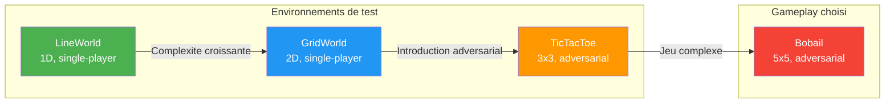
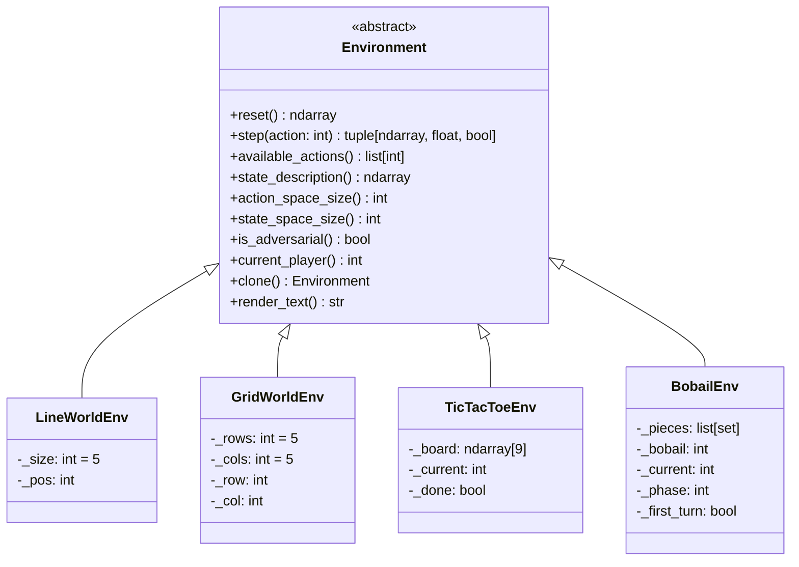
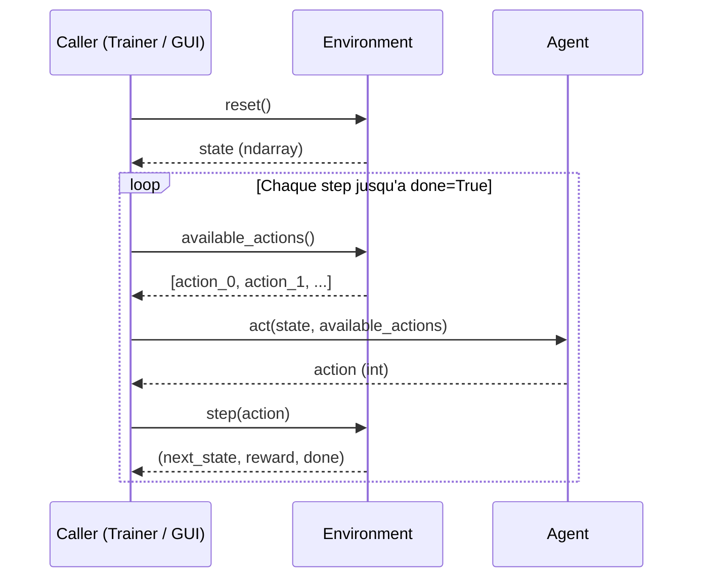

# Vue d'ensemble des Environnements

## Les 4 environnements implementes



## Tableau comparatif

| Propriete | LineWorld | GridWorld | TicTacToe | Bobail |
|-----------|-----------|-----------|-----------|--------|
| **Type** | Navigation 1D | Navigation 2D | Jeu de plateau | Jeu de plateau |
| **Joueurs** | 1 (single-player) | 1 (single-player) | 2 (adversarial) | 2 (adversarial) |
| **Taille de grille** | 5 cellules | 5x5 = 25 cellules | 3x3 = 9 cellules | 5x5 = 25 cellules |
| **Taille du vecteur d'etat** | 5 | 25 | 27 (3 x 9) | 75 (3 x 25) |
| **Taille de l'espace d'actions** | 2 | 4 | 9 | 625 |
| **Actions legales typiques** | 1-2 | 2-4 | 5-9 | ~20-60 |
| **Reward victoire** | +1.0 | +1.0 | +1.0 | +1.0 |
| **Reward defaite** | N/A | N/A | -1.0 (implicite) | -1.0 (implicite) |
| **Reward autre** | 0.0 | 0.0 | 0.0 | 0.0 |
| **Encodage etat** | One-hot | One-hot | 3 canaux binaires | 3 canaux binaires |
| **Perspective** | N/A | N/A | Joueur courant | Joueur courant |
| **Action masking** | Oui (bords) | Oui (bords) | Oui (cases occupees) | Oui (mouvements legaux) |

## Interface commune : `Environment` (ABC)



## Cycle de vie d'un episode



## Registre des environnements

Le fichier `environments/__init__.py` definit un registre qui lie les noms aux classes :

```python
ENV_REGISTRY = {
    "line_world": LineWorldEnv,
    "grid_world": GridWorldEnv,
    "tictactoe":  TicTacToeEnv,
    "bobail":     BobailEnv,
}
```

Instanciation : `env = get_env("bobail")` cree une instance prete a l'emploi.

---

## LineWorld : Navigation 1D

```
Position initiale:        Position finale (victoire):
[A|.|.|.|G]               [.|.|.|.|A]
 0 1 2 3 4                 0 1 2 3 4
```

- **Action 0** : aller a gauche (si pos > 0)
- **Action 1** : aller a droite (si pos < 4)
- **Objectif** : atteindre la cellule 4 (goal)
- **Reward** : 1.0 quand pos == 4, sinon 0.0

---

## GridWorld : Navigation 2D

```
Position initiale:           Position finale:
 A . . . .                    . . . . .
 . . . . .                    . . . . .
 . . . . .        -->         . . . . .
 . . . . .                    . . . . .
 . . . . G                    . . . . A
```

| Action | Direction | Delta |
|--------|-----------|-------|
| 0 | Haut | row - 1 |
| 1 | Bas | row + 1 |
| 2 | Gauche | col - 1 |
| 3 | Droite | col + 1 |

- **Objectif** : atteindre (4, 4) depuis (0, 0)
- **Action masking** : impossible de sortir de la grille

---

## TicTacToe : Morpion adversarial

```
Indexes des cellules:     Exemple en cours:
  0 | 1 | 2                X | O | .
  ---------                ---------
  3 | 4 | 5                . | X | .
  ---------                ---------
  6 | 7 | 8                O | . | .
```

- **9 actions** : une par cellule (0 a 8)
- **Action masking** : seules les cases vides sont jouables
- **Lignes gagnantes** : 8 combinaisons (3 lignes + 3 colonnes + 2 diagonales)

---

## Bobail : Le jeu choisi

Voir [bobail.md](bobail.md) pour la documentation complete.
