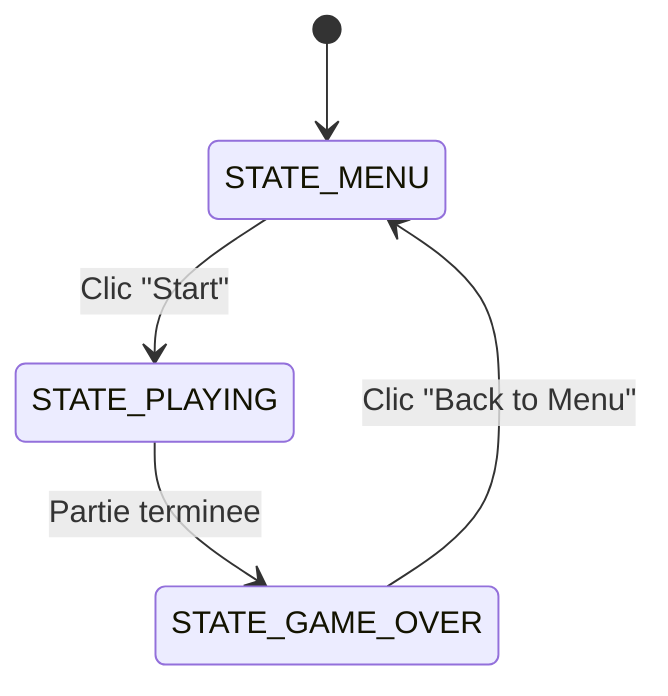
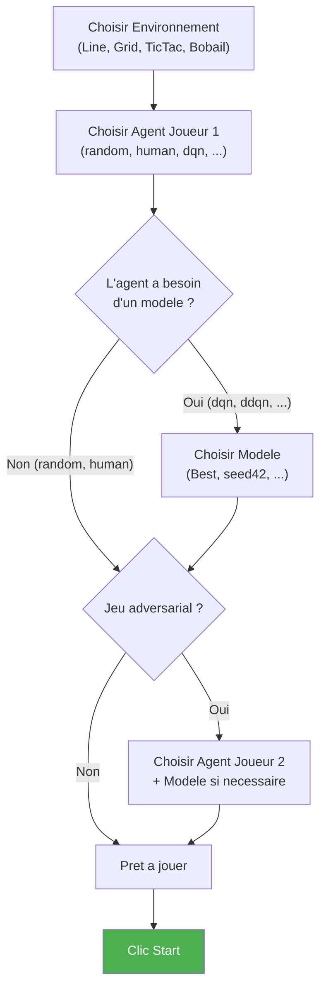
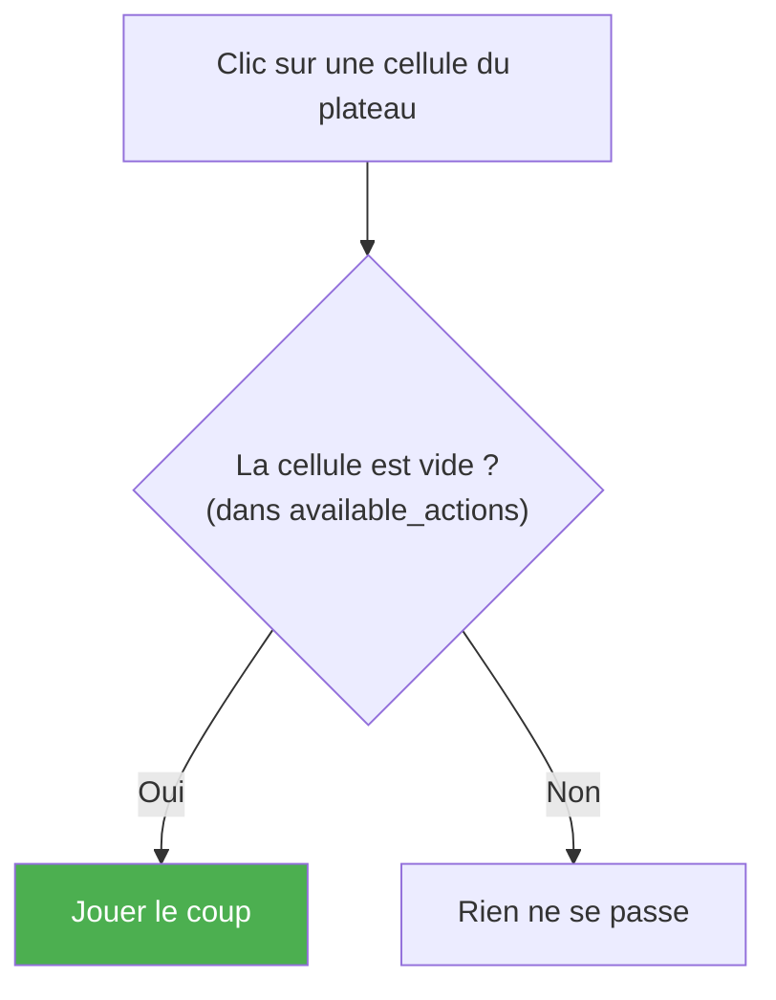
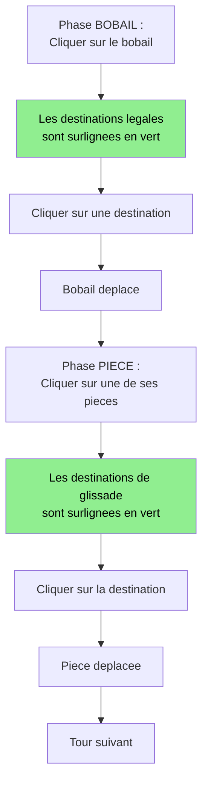
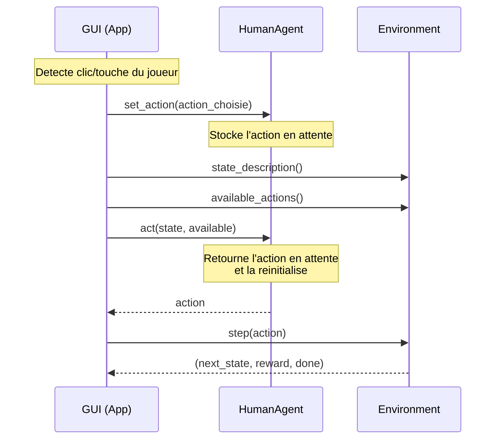

# Jeu avec Joueur Humain + GUI

## Objectif

Le sujet demande : *"Jeu avec joueur humain + GUI"*.

L'interface graphique PyGame permet de :
- **Regarder jouer** chaque agent (AI vs AI)
- **Jouer en tant qu'humain** contre une IA ou un autre humain

---

## Lancement

```bash
uv run python scripts/run_gui.py
```

---

## Architecture de la GUI



### Fenetre

| Propriete | Valeur |
|-----------|--------|
| **Dimensions** | 900 x 700 pixels |
| **FPS** | 60 |
| **Delai entre coups IA** | 400 ms |
| **Framework** | PyGame |

---

## Ecran Menu

```
┌──────────────────────────────────────────────────────────┐
│                  Deep RL — Game GUI                        │
│                                                            │
│  Environment                                               │
│  ┌──────┐ ┌──────┐ ┌────────┐ ┌────────┐                 │
│  │ Line │ │ Grid │ │ TicTac │ │ Bobail │                  │
│  └──────┘ └──────┘ └────────┘ └────────┘                  │
│                                                            │
│  Agent (Player 1)                                          │
│  ┌────────┐ ┌───────┐ ┌─────┐ ┌──────┐ ┌──────┐ ...     │
│  │ random │ │ human │ │ dqn │ │ ddqn │ │ etc. │          │
│  └────────┘ └───────┘ └─────┘ └──────┘ └──────┘          │
│                                                            │
│  Model (P1)                                                │
│  ┌──────┐ ┌────────┐ ┌────────┐                           │
│  │ Best │ │ seed42 │ │ seed123│                            │
│  └──────┘ └────────┘ └────────┘                            │
│                                                            │
│  Agent (Player 2)     ← seulement pour jeux adversariaux  │
│  [meme selecteur]                                          │
│                                                            │
│              ┌──────────────┐                              │
│              │    Start     │                              │
│              └──────────────┘                              │
└──────────────────────────────────────────────────────────┘
```

### Selections du menu



### Decouverte des modeles

Les modeles entraines sont cherches dans :
```
results/{env_name}/{agent_name}/best/model.pt       ← "Best" button
results/{env_name}/{agent_name}/{run_name}/model_*.pt ← run buttons
```

---

## Ecran de jeu

```
┌─────────────────────────────────────┬──────────────────┐
│                                     │  Tic Tac Toe     │
│                                     │                  │
│                                     │  P1: human       │
│          Zone de jeu                │  P2: dqn         │
│          (plateau)                  │                  │
│                                     │  Your turn       │
│                                     │  Use arrow keys  │
│                                     │                  │
│                                     │                  │
│                                     │                  │
│                                     │                  │
│                                     │ ┌──────────────┐ │
│                                     │ │ Back to Menu │ │
│                                     │ └──────────────┘ │
└─────────────────────────────────────┴──────────────────┘
         Zone de rendu (690x700)        Sidebar (210px)
```

---

## Controles Humain par Environnement

### LineWorld / GridWorld : Clavier

| Touche | Action |
|--------|--------|
| `←` Fleche gauche | Action 0 (gauche) / Action 2 (gauche) |
| `→` Fleche droite | Action 1 (droite) / Action 3 (droite) |
| `↑` Fleche haut | Action 0 (haut) - GridWorld uniquement |
| `↓` Fleche bas | Action 1 (bas) - GridWorld uniquement |

### TicTacToe : Clic souris



### Bobail : Clic souris en 2 etapes



**Detail de l'interaction Bobail :**

1. **Premier clic** : selectionner une piece (ou le bobail selon la phase)
   - La piece selectionnee passe en orange
   - Les destinations legales sont surlignees en vert
2. **Second clic** : choisir la destination
   - Si la destination est legale → le mouvement est execute
   - Si clic ailleurs → deselection, retour a l'etape 1

---

## Agent Humain (`HumanAgent`)



Le `HumanAgent` est un "pont" entre l'input GUI et l'interface Agent :

```python
class HumanAgent(Agent):
    def set_action(self, action: int):
        self._pending_action = action   # stocke l'action du joueur

    def act(self, state, available_actions, training=False):
        action = self._pending_action   # retourne l'action stockee
        self._pending_action = None
        return action
```

---

## Rendu visuel par environnement

### LineWorld
- Cellules horizontales colorees
- Agent = cellule bleue avec "A"
- Goal = cellule verte avec "G"

### GridWorld
- Grille 5x5 en damier
- Agent = cellule bleue avec "A"
- Goal = cellule verte avec "G"

### TicTacToe
- Grille 3x3
- X = lignes croisees bleues
- O = cercle rouge

### Bobail
- Grille 5x5 en damier
- Pieces J1 = cercles bleus avec "1"
- Pieces J2 = cercles rouges avec "2"
- Bobail = cercle jaune
- Piece selectionnee = cercle orange
- Destinations legales = cases vertes
- Indicateurs de rangee maison (fleches en haut/bas du plateau)

---

## Modes de jeu possibles

| Mode | Player 1 | Player 2 | Description |
|------|----------|----------|-------------|
| **Humain vs IA** | `human` | `dqn` / `ddqn` / ... | Jouer contre un agent entraine |
| **IA vs IA** | `dqn` | `ddqn` | Observer deux agents jouer |
| **Humain vs Humain** | `human` | `human` | Deux joueurs humains |
| **IA vs Random** | `dqn` | `random` | Evaluer visuellement un agent |

Le delai de 400ms entre les coups IA permet de **suivre visuellement** la partie.
