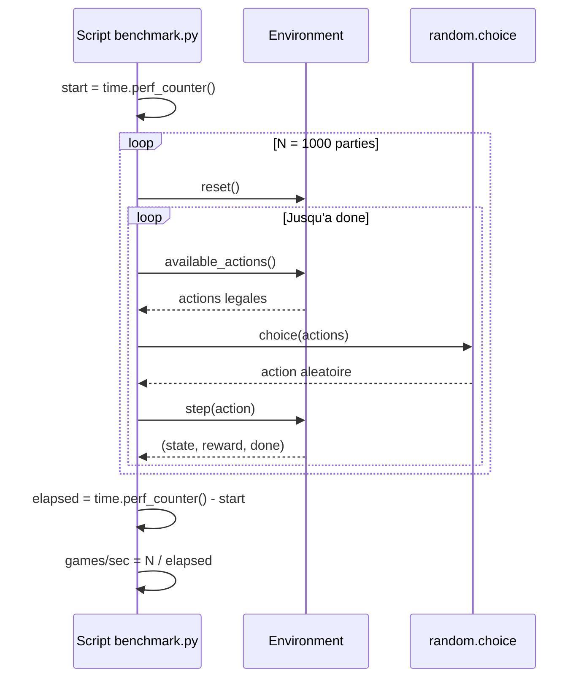
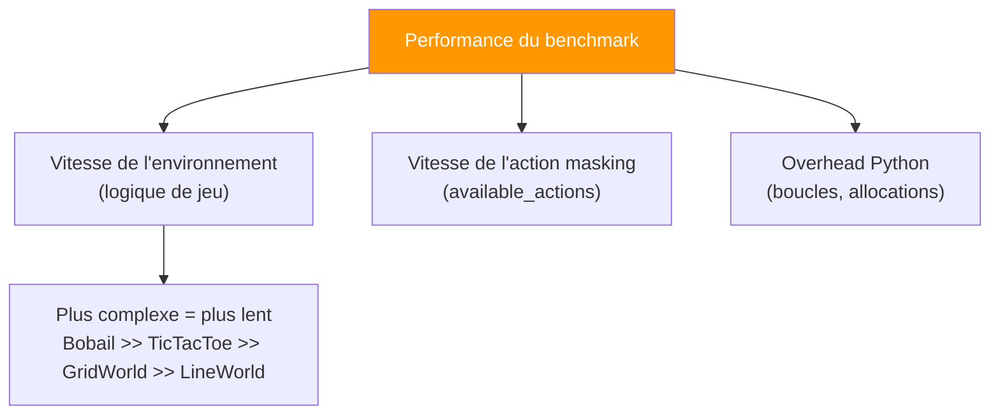

# Simulation avec Joueur Random & Benchmark

## Objectif

Le sujet demande : *"Simulation de jeu avec joueur random (calculer le nombre de parties / seconde)"*.

Ce document explique comment le benchmark est implemente et comment l'executer.

---

## Implementation : `scripts/benchmark.py`

Le script execute N parties aleatoires par environnement et mesure la performance.



### Code source (simplifie)

```python
def benchmark_env(env_name: str, n_games: int) -> tuple[float, float]:
    env = get_env(env_name)
    total_steps = 0
    start = time.perf_counter()

    for _ in range(n_games):
        env.reset()
        done = False
        steps = 0
        while not done:
            action = random.choice(env.available_actions())
            _, _, done = env.step(action)
            steps += 1
        total_steps += steps

    elapsed = time.perf_counter() - start
    return n_games / elapsed, total_steps / n_games
```

## Execution

```bash
# 1000 parties par defaut
uv run python scripts/benchmark.py

# Nombre personnalise de parties
uv run python scripts/benchmark.py 5000
```

### Sortie attendue

```
Running 1000 random games per environment...

Environment       Games/sec    Avg steps
------------------------------------------
line_world         XXXXX.X          X.X
grid_world          XXXX.X         XX.X
tictactoe           XXXX.X          X.X
bobail               XXX.X         XX.X
```

## Metriques collectees

| Metrique | Description |
|----------|-------------|
| **Games/sec** | Nombre de parties completes executees par seconde |
| **Avg steps** | Nombre moyen de steps (actions) par partie |

## Ce que le benchmark mesure



### Facteurs de performance par environnement

| Env | Complexite de `step()` | Complexite de `available_actions()` | Attendu |
|-----|----------------------|--------------------------------------|---------|
| **LineWorld** | O(1) - simple update position | O(1) - 1-2 checks | Tres rapide |
| **GridWorld** | O(1) - simple update position | O(1) - 4 checks max | Tres rapide |
| **TicTacToe** | O(1) - pose mark + check 8 lignes | O(9) - scan du plateau | Rapide |
| **Bobail** | O(1) pour bobail, O(directions) pour pieces | O(pieces × directions × slides) | Plus lent |

## Lien avec l'evaluation des agents

Le benchmark random sert egalement de **baseline** pour comparer les performances des agents entraines. Un agent intelligent devrait :

1. **Gagner plus souvent** que le joueur random (higher mean_reward)
2. **Gagner plus vite** (fewer mean_steps)

Les metriques d'evaluation (`evaluation/evaluator.py`) incluent aussi le **temps moyen par action** (`mean_action_time_ms`), qui permet de comparer la latence decisionnelle entre :

| Agent | Temps par action attendu |
|-------|-------------------------|
| **Random** | ~0.001 ms (quasi-instantane) |
| **Tabular Q** | ~0.01 ms (lookup dict) |
| **DQN/DDQN** | ~0.1-1.0 ms (forward pass reseau) |
| **DDQN+PER** | ~0.1-1.0 ms (forward pass reseau) |
