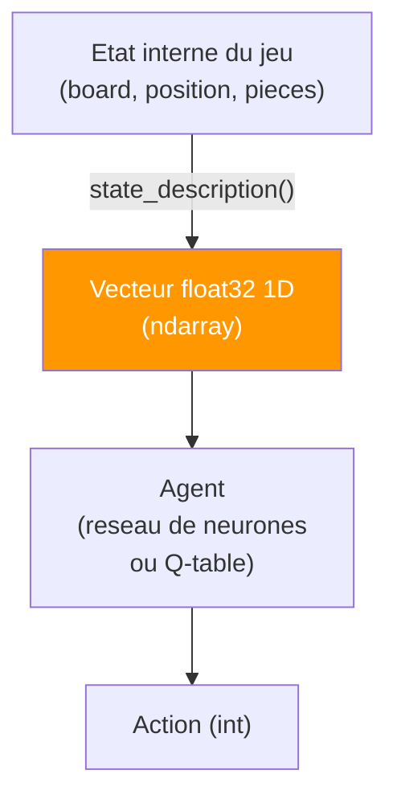
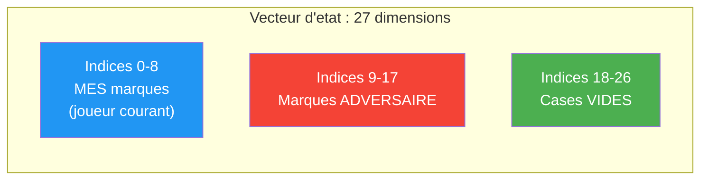
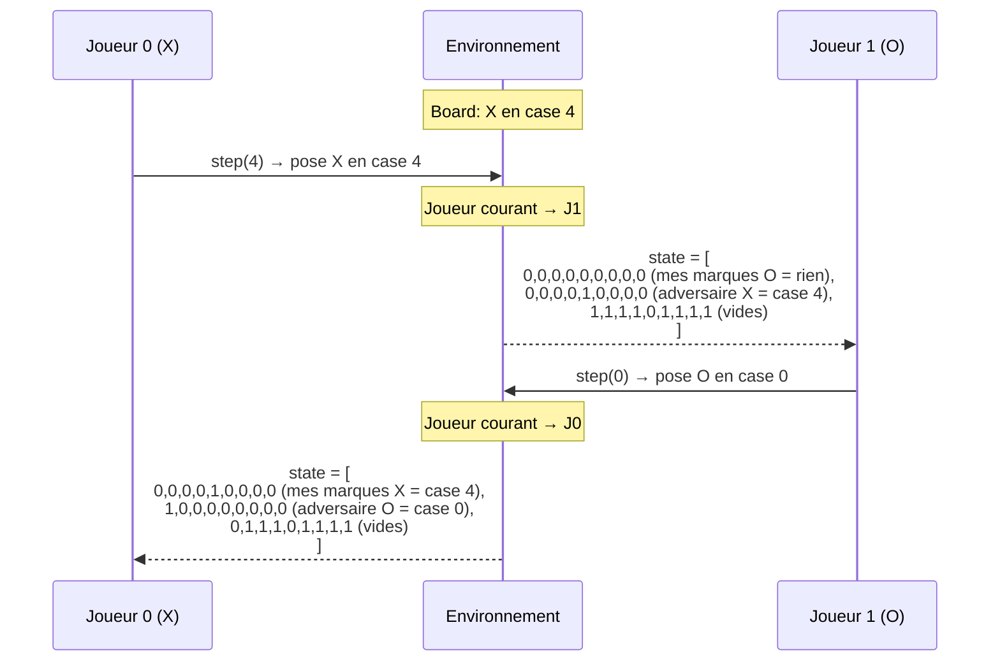
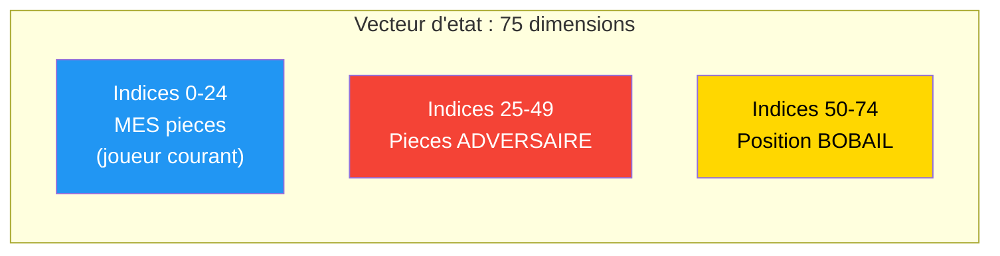
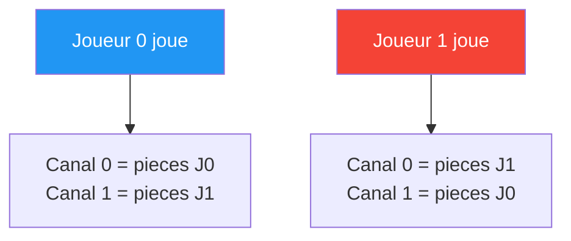
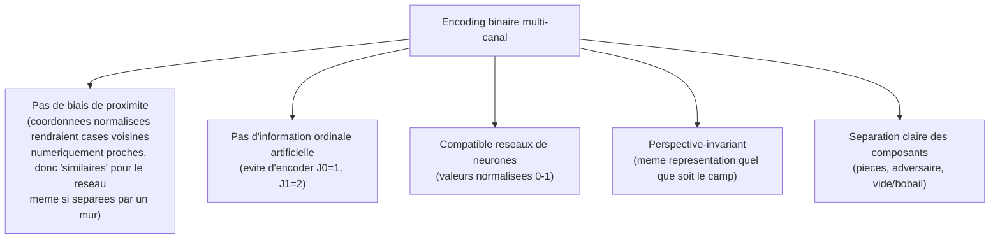

# Vecteurs d'encoding de l'etat du jeu

Ce document decrit comment l'etat de chaque environnement est encode en un vecteur numerique `np.ndarray[float32]` plat, utilisable par les agents (reseaux de neurones, Q-table, etc.).

---

## Principes d'encoding



### Proprietes communes

| Propriete | Description |
|-----------|-------------|
| **Type** | `np.ndarray`, dtype `float32` |
| **Forme** | Toujours 1D (vecteur plat) |
| **Valeurs** | Binaires (0.0 ou 1.0) pour tous les environnements |
| **Encodage** | One-hot (single-player) ou multi-canal binaire (adversarial) |

---

## 1. LineWorld : One-Hot (5 dims)

### Structure

```
state = [0.0, 0.0, 1.0, 0.0, 0.0]
         ↑    ↑    ↑    ↑    ↑
        pos0 pos1 pos2 pos3 pos4
                   ↑
            Agent est ici (position 2)
```

| Propriete | Valeur |
|-----------|--------|
| **Taille** | 5 (= nombre de cellules) |
| **Encoding** | One-hot : exactement un `1.0` a la position de l'agent |
| **Code** | `state[pos] = 1.0` |

### Exemple step-by-step

```
Etape 0 (reset) :  [1.0, 0.0, 0.0, 0.0, 0.0]   Agent en position 0
Action 1 (droite):  [0.0, 1.0, 0.0, 0.0, 0.0]   Agent en position 1
Action 1 (droite):  [0.0, 0.0, 1.0, 0.0, 0.0]   Agent en position 2
Action 1 (droite):  [0.0, 0.0, 0.0, 1.0, 0.0]   Agent en position 3
Action 1 (droite):  [0.0, 0.0, 0.0, 0.0, 1.0]   Agent en position 4 → VICTOIRE
```

---

## 2. GridWorld : One-Hot (25 dims)

### Structure

```
Grille 5x5 → 25 cellules → vecteur de 25 floats
Index = row * cols + col = row * 5 + col

     col0  col1  col2  col3  col4
row0 [  0     1     2     3     4  ]
row1 [  5     6     7     8     9  ]
row2 [ 10    11    12    13    14  ]
row3 [ 15    16    17    18    19  ]
row4 [ 20    21    22    23    24  ]
```

| Propriete | Valeur |
|-----------|--------|
| **Taille** | 25 (= 5 x 5) |
| **Encoding** | One-hot : exactement un `1.0` a la position (row, col) de l'agent |
| **Code** | `state[row * cols + col] = 1.0` |

### Exemple

```
Agent en (1, 3) :
state = [0, 0, 0, 0, 0,    ← row 0
         0, 0, 0, 1, 0,    ← row 1 (index 8 = 1*5+3)
         0, 0, 0, 0, 0,    ← row 2
         0, 0, 0, 0, 0,    ← row 3
         0, 0, 0, 0, 0]    ← row 4
```

---

## 3. TicTacToe : 3 Canaux x 9 = 27 dims

### Structure



| Canal | Indices | Contenu | Code |
|-------|---------|---------|------|
| **Mes marques** | 0-8 | `1.0` si la cellule contient mon symbole | `board == my_mark` |
| **Marques adversaire** | 9-17 | `1.0` si la cellule contient le symbole adverse | `board == opp_mark` |
| **Cases vides** | 18-26 | `1.0` si la cellule est vide | `board == 0` |

### Mapping cellule → index

```
Cellule :   0 | 1 | 2       Canal 0 (moi):  state[0..8]
            ---------       Canal 1 (adv):  state[9..17]
            3 | 4 | 5       Canal 2 (vide): state[18..26]
            ---------
            6 | 7 | 8
```

### Propriete CRITIQUE : Perspective du joueur courant

L'etat est **toujours du point de vue du joueur a qui c'est le tour**. Quand le joueur change, les canaux "moi" et "adversaire" sont permutes.



### Exemple concret

```
Board interne :  X | . | O      Joueur courant = O (joueur 1)
                 ---------
                 . | X | .      my_mark = 2 (O), opp_mark = 1 (X)
                 ---------
                 . | . | .

Etat encode (27 floats) :
  Canal "moi" (O) :  [0, 0, 1, 0, 0, 0, 0, 0, 0]   → O en case 2
  Canal "adv" (X) :  [1, 0, 0, 0, 1, 0, 0, 0, 0]   → X en cases 0, 4
  Canal "vide"    :  [0, 1, 0, 1, 0, 1, 1, 1, 1]   → cases 1,3,5,6,7,8

Vecteur complet : [0,0,1,0,0,0,0,0,0, 1,0,0,0,1,0,0,0,0, 0,1,0,1,0,1,1,1,1]
```

---

## 4. Bobail : 3 Canaux x 25 = 75 dims

### Structure



| Canal | Indices | Contenu | Code |
|-------|---------|---------|------|
| **Mes pieces** | 0-24 | `1.0` pour chaque cellule contenant une de mes pieces | `pieces[current]` |
| **Pieces adversaire** | 25-49 | `1.0` pour chaque cellule contenant une piece adverse | `pieces[1-current]` |
| **Bobail** | 50-74 | `1.0` pour la cellule contenant le bobail | `bobail_pos` |

### Mapping cellule → position dans le canal

```
Cellule (r,c) → Index dans canal = r * 5 + c

     col0  col1  col2  col3  col4
row0 [  0     1     2     3     4  ]
row1 [  5     6     7     8     9  ]
row2 [ 10    11    12    13    14  ]
row3 [ 15    16    17    18    19  ]
row4 [ 20    21    22    23    24  ]
```

### Exemple : etat initial (POV Joueur 0)

```
Plateau :                   Canal 0 (mes pieces J0) :    Canal 1 (adversaire J1) :   Canal 2 (bobail) :
  1 1 1 1 1                   0 0 0 0 0                    1 1 1 1 1                   0 0 0 0 0
  . . . . .                   0 0 0 0 0                    0 0 0 0 0                   0 0 0 0 0
  . . B . .                   0 0 0 0 0                    0 0 0 0 0                   0 0 1 0 0
  . . . . .                   0 0 0 0 0                    0 0 0 0 0                   0 0 0 0 0
  0 0 0 0 0                   1 1 1 1 1                    0 0 0 0 0                   0 0 0 0 0

Vecteur complet (75 floats) :
[0,0,0,0,0, 0,0,0,0,0, 0,0,0,0,0, 0,0,0,0,0, 1,1,1,1,1,    ← mes pieces
 1,1,1,1,1, 0,0,0,0,0, 0,0,0,0,0, 0,0,0,0,0, 0,0,0,0,0,    ← adversaire
 0,0,0,0,0, 0,0,0,0,0, 0,0,1,0,0, 0,0,0,0,0, 0,0,0,0,0]    ← bobail
```

### Propriete CRITIQUE : Perspective du joueur courant

Exactement comme pour TicTacToe, les canaux sont **permutes** selon le joueur courant :



Cela permet a un meme reseau de neurones d'apprendre a jouer independamment du "camp" : il voit toujours "mes pieces" et "pieces adverses".

---

## Resume : Tableau de synthese des encodings

| Env | Dims | Methode | Invariants |
|-----|------|---------|------------|
| **LineWorld** | 5 | One-hot position | Exactement 1 valeur a 1.0 |
| **GridWorld** | 25 | One-hot position | Exactement 1 valeur a 1.0 |
| **TicTacToe** | 27 | 3 canaux binaires (moi, adv, vide) | Somme de chaque position sur les 3 canaux = 1.0 |
| **Bobail** | 75 | 3 canaux binaires (moi, adv, bobail) | Canal 0 : exactement 5 valeurs a 1.0, Canal 1 : 5, Canal 2 : 1 |

### Pourquoi cet encoding ?


